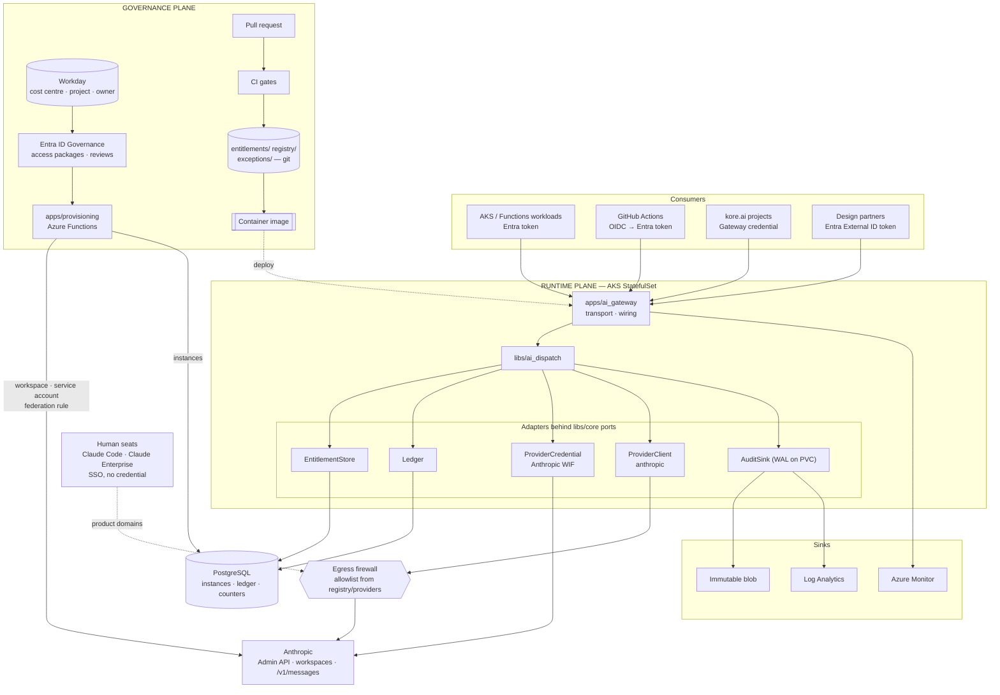
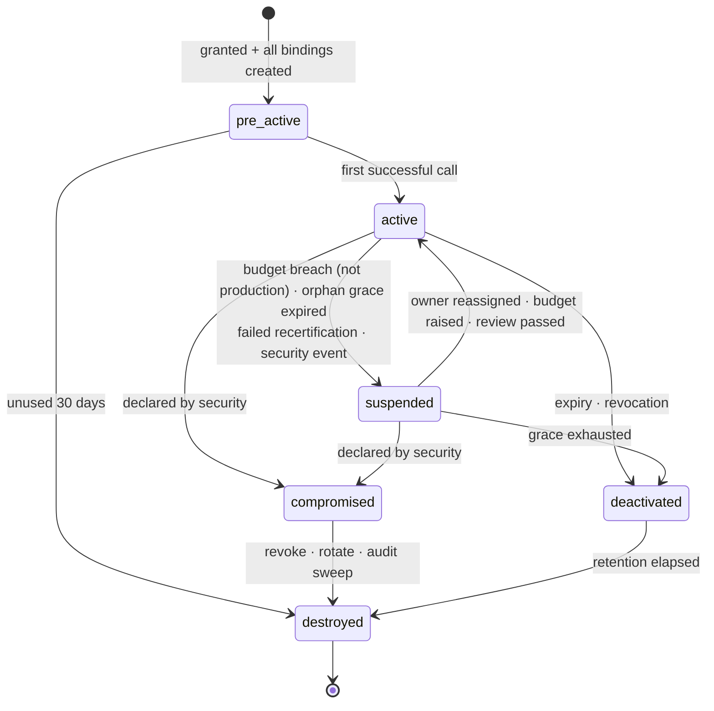
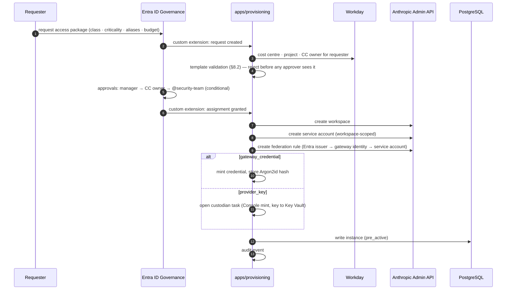

# AI API Credential Operating Model — Design

**Date:** 2026-09-04 (revised 2026-09-08)
**Status:** Draft for review
**Scope:** The credential control plane for consuming AI providers
**Sibling:** `2026-09-04-mcp-gateway-design.md`

---

## 1. Purpose

Define how identities obtain, hold, and lose the ability to call AI providers
and spend money doing so, such that every call is attributable to one
accountable human and one Workday cost centre.

Five questions define the deliverable:

1. How do employees obtain company-managed AI access instead of personal API keys?
2. Who owns provisioning, rotation, revocation, auditing, and spend governance?
3. How do agents, MCP servers, automations, and CI/CD obtain API access?
4. How do external design partners reach AI capabilities?
5. How is a vendor-neutral posture maintained across Claude, OpenAI, and future providers?

---

## 2. Relationship to the MCP Gateway

Siblings in one repository. Neither subsumes the other.

| | MCP Gateway | AI Gateway (this spec) |
|---|---|---|
| Direction | agent → enterprise services | workload/agent → AI providers |
| Governs | what an identity may **do** | what an identity may **call and spend** |
| Credential shape | Entra OBO per call, nothing stored | Anthropic workload identity federation per entitlement, nothing long-lived |
| Failure posture | fail closed uniformly | graduated by `criticality` (§16) |
| Content logging default | `hashed` | `none` |
| Policy engine | Cedar | none: deterministic table checks |

**Reused, not duplicated:** `libs/core` (types, ports, `AgentIdentity`),
`libs/audit` (WAL, drain, HMAC), `libs/identity` (Entra token validation),
`import-linter`, CODEOWNERS, principles P1–P7.

**Separate runtimes.** Model egress is high-throughput streaming; tool
invocation is low-throughput and policy-heavy. Correlation is by shared
`trace_id` and `intent_id` in both audit logs (§15.3).

**Workday** is read by provisioning at design time only. It is never a runtime
destination; the sibling's deferral of Workday as a tool destination is
unaffected.

---

## 3. Principles

P1–P7 from the sibling apply. Five more:

1. **C-P1 — The entitlement is the unit of governance, not the credential.** A
   secret is an output of provisioning, never a separate path.
2. **C-P2 — Every entitlement has exactly one accountable human at all times.**
   Orphaning is structurally impossible.
3. **C-P3 — Prefer eliminating a secret to managing one.** Federation beats
   rotation; rotation beats vaulting. Every step down is a declared, expiring
   exception.
4. **C-P4 — The sanctioned path must be the easiest path.** Enforcement without
   a better alternative produces shadow usage. This orders delivery (§21).
5. **C-P5 — Attribution is stamped at request time, never reconstructed from
   invoices.**

---

## 4. Decisions

| # | Decision | Choice |
|---|---|---|
| C1 | Egress | Mandatory AI Gateway as sole programmatic egress. It reaches Anthropic by **workload identity federation** with one federation rule per entitlement; no long-lived provider credential exists anywhere in the sanctioned path |
| C2 | Provisioning front door | Entra ID Governance access packages. Workday is authoritative for cost centre, project id, and cost-centre owner |
| C3 | Humans | **No API credential, ever.** Claude Code via Console org membership with role `claude_code_user`; Claude Enterprise web via SSO seat. Disabling the Entra account is the revocation |
| C4 | Workload authentication to the Gateway | Entra access token by default; a Gateway-minted credential only for SaaS that cannot do OAuth; a provider API key only where the Gateway cannot be used. The last two are exceptions with an expiry |
| C5 | Ownership | One accountable individual plus automatic fallback to the cost-centre owner |
| C6 | Ceilings | Tiered by declared `criticality`: `interactive` \| `batch` \| `production` |
| C7 | Top-ups | Always approver-gated; engineering effort goes into approval latency |
| C8 | Seats vs API | Provisioning refuses an API entitlement for interactive use |
| C9 | Vendor neutrality | Native provider protocols plus a git-governed **model alias registry**, eval-gated |
| C10 | Shadow AI | Network egress deny-by-default; allowlist generated from the provider registry. Managed estate only |
| C11 | kore.ai | A governed consumer: one entitlement and one provider workspace per project, authenticated by Gateway credential |
| C12 | Sub-attribution | Caller-asserted end user with `derived` or `declared` attestation. Throttle and charge on an assertion; never authorize on one |
| C13 | Provider tenancy | One Anthropic workspace per entitlement, created by provisioning. Rate limits, invoice lines, and CMEK all land on one object |
| C14 | Revocation | Programmatic in every case: archive the federation rule, deactivate the credential, archive the workspace. Issuance may be partly manual; revocation never is |
| C15 | Burn-rate breaker | A rolling-window breaker independent of budget, applied to every criticality |
| C16 | State | One PostgreSQL database for entitlement instances, spend ledger, and counters. Registries are git, baked into the image |

---

## 5. Components

### 5.1 Component view



Human seats bypass the Gateway. A seat carries no credential, its cost is a
fixed per-person charge, and its revocation is the Entra account.

### 5.2 Component list

| Component | Kind | Responsibility | State |
|---|---|---|---|
| `apps/ai_gateway` | Service | Exposes each provider's native API under `/anthropic/v1/messages`. Validates the caller's credential. Requires `model` to be an alias. Streams. Wiring only. | none |
| `libs/ai_dispatch` | Library | Steps 2–10 of the request lifecycle (§11). | — |
| `libs/entitlement` | Library | `EntitlementStore` port and PostgreSQL adapter; lifecycle state machine (§7.3); in-process cache with a hard max-staleness of 600 s. | — |
| `libs/alias` | Library | Loads `registry/` from the image; resolves alias → route and params; classification check. Pure. | — |
| `libs/budget` | Library | `Ledger` port and PostgreSQL adapter; budget position by criticality; burn-rate breaker. | — |
| `libs/providers` | Library | `ProviderCredential`: exchanges the pod's Entra token at Anthropic `/v1/oauth/token` per entitlement; caches the 600 s token in process. `ProviderClient`: `anthropic` adapter (official SDK with a per-request bearer token). | in-process token cache |
| `libs/core`, `libs/audit`, `libs/identity` | Shared | From the sibling. `libs/audit` runs with group commit (fsync batches ≤ 5 ms). | WAL on PVC |
| `apps/provisioning` | Azure Functions | Webhook target for Entra ID Governance custom extensions on grant and removal. Reads Workday, calls the Anthropic Admin API, writes instances, mints Gateway credentials, opens custodian tasks. Timer-triggered reconciler: converges `pre_active`, applies joiner-mover-leaver events, runs monthly invoice reconciliation. | none |
| `entitlements/templates/` | Data | What may be requested and its bounds. | git |
| `registry/aliases/`, `registry/providers/`, `registry/pricing/` | Data | Model aliases, provider endpoints and retention terms, price table. | git |
| `exceptions/` | Data | Every long-lived secret, with owner, reason, expiry. | git |
| PostgreSQL | Azure Database for PostgreSQL | Entitlement instances, spend ledger, burn-rate counters, Gateway credential hashes. | stateful |
| Entra ID + Entra ID Governance | External | Identity, groups, access packages, approvals, access reviews, joiner-mover-leaver from Workday. | — |
| Workday | External | Read-only report: cost centre, project id, cost-centre owner, manager, termination and transfer events. | — |
| Key Vault | External | Payload HMAC key; provider API keys for rung 3 only. | — |
| Anthropic | External | Admin API (workspaces, service accounts, federation issuers and rules, key deactivation), `/v1/oauth/token`, `/v1/messages`. | — |
| Egress firewall | External | Azure Firewall FQDN rules generated from `registry/providers/`. | — |
| Immutable blob, Log Analytics, Azure Monitor | External | As the sibling. Showback is a Log Analytics workbook over the audit index. | — |

The Gateway has two stateful components: the WAL and PostgreSQL.

### 5.3 Systems of record

| Truth | Owner | Read by |
|---|---|---|
| Cost centre, project id, cost-centre owner, employment events | Workday | provisioning |
| Identity, group membership, workload identities | Entra ID | Gateway, provisioning |
| Templates, aliases, providers, prices, exceptions | git | image build, CI |
| Entitlement instances, lifecycle state, spend | PostgreSQL | Gateway, provisioning |
| Audit record | immutable blob | `just explain`, showback, reconciliation |

No value is copied into a second system where it can go stale.

### 5.4 Repository layout

```
libs/entitlement/           # EntitlementStore port, PostgreSQL adapter, state machine
libs/alias/                 # registry loading, AliasResolver
libs/budget/                # Ledger port, PostgreSQL adapter, breaker
libs/providers/             # ProviderCredential (anthropic_wif), ProviderClient (anthropic)
libs/ai_dispatch/           # §11 steps 2–10

apps/ai_gateway/            # native-protocol proxy: transport, wiring
apps/provisioning/          # Azure Functions: EIG webhook + reconciler

entitlements/templates/*.yaml      @security-team
registry/aliases/*.yaml            @ai-platform @security-team
registry/providers/*.yaml          @security-team
registry/pricing/*.yaml            @ai-platform
exceptions/*.yaml                  @security-team
```

The sibling's dependency rule applies: every library depends on `libs/core`
only; apps compose.

---

## 6. Roles

| Role | Who | Accountable for |
|---|---|---|
| Entitlement owner | named individual | justification, alias choice, budget, alerts |
| Cost-centre owner | resolved from Workday | budget and top-up approval; automatic fallback owner |
| Credential custodian | AI Platform team | issuance, rotation, revocation mechanics |
| Security | `@security-team` | templates, exception register, provider onboarding |
| Provider owner | AI Platform | contract, DPA, retention terms, price table, aliases |

The custodian never decides who gets access; the owner never touches secret
material. Enforced by CODEOWNERS on `entitlements/templates/**` and
`exceptions/**`.

---

## 7. The entitlement model

### 7.1 Templates and instances

| | Template | Instance |
|---|---|---|
| Where | `entitlements/templates/*.yaml` | PostgreSQL |
| Governed by | CODEOWNERS PR | access package grant |
| Contains | what may be requested, and bounds | one grant with lifecycle state |

Instances never widen a template. A request outside the bounds is a template
change routed to `@security-team`.

### 7.2 Instance

```yaml
id: ent-7f2a
template: workload-inference-standard
principal:
  type: workload | platform | partner
  ref: <Entra object id | kore.ai project id | Entra External ID object id>
owner:
  accountable: <Entra oid>               # email is mutable; resolved for display
  # fallback: cost-centre owner, resolved from Workday at read time, never stored
workday:
  cost_centre: CC-4471
  project_id: PRJ-10023
providers: [anthropic]
model_aliases: [reasoning-heavy-v1]
tenancy:
  anthropic:
    workspace_id: wrkspc_...
    service_account_id: svac_...
    federation_rule_id: fdrl_...
criticality: interactive | batch | production
budget:
  amount_monthly: 2000
  currency: USD
  version: 3                             # incremented by each top-up
binding: entra_token | gateway_credential | provider_key
state: pre_active | active | suspended | deactivated | compromised | destroyed
expires_at: 2027-03-04
```

### 7.3 Lifecycle



Every transition has a mechanical trigger. Orphans reach `suspended`, not
`deactivated`: nobody breaks production to enforce paperwork.

### 7.4 Joiner–mover–leaver

Driven by Workday → Entra HR-driven provisioning.

- **Leaver.** Entra account disabled ends human access immediately. Owned
  entitlements transfer to the cost-centre owner at once; a reassignment task
  opens; after **14 days** unclaimed, the entitlement suspends.
- **Mover.** A cost-centre change flags the entitlement; the receiving
  cost-centre owner re-affirms at the next review or it suspends.
- **Recertification.** Entra access reviews: quarterly for partners, semi-annual
  otherwise. Non-response suspends.

---

## 8. Provisioning

### 8.1 Flow



The Entra federation issuer at Anthropic (`https://login.microsoftonline.com/{tid}/v2.0`)
is created once. Every Gateway-egress entitlement gets its own workspace, service
account, and federation rule; the Gateway's single managed identity matches all
rules and selects one by `federation_rule_id` at exchange time.

### 8.2 Template validation

Provisioning refuses:

- an API entitlement for an interactive class (C8);
- `criticality: production` without a named on-call rota;
- a partner template without a DPA reference or an end date;
- a GitHub Actions federated credential whose subject does not pin an environment or ref (§9.4);
- an alias not permitted by the template;
- a budget above the template ceiling without `@security-team` in the approval chain.

### 8.3 Automation is the only minting path

No human mints a Gateway credential or creates a federation rule outside
`apps/provisioning`. The Anthropic Admin API cannot create API keys (it lists
and updates them only), so rung 3 keys are created in the Console by the
custodian from an automation-opened task; the custodian cannot approve the
entitlement that consumes the key.

### 8.4 Partial failure converges

If the workspace is created but a later step fails, the instance stays
`pre_active` and the reconciler retries. Nothing reaches `active` without every
binding present.

---

## 9. Access patterns

### 9.1 Humans — a seat, never a credential

| Need | Grant | Cost | Revocation |
|---|---|---|---|
| Claude Code | Anthropic Console org membership, role `claude_code_user`, via access package | per-user usage against the Console org, capped by per-user spend limit | Entra account disable; org removal is hygiene |
| Claude Enterprise web | SSO seat in the Claude Enterprise org, via access package | fixed per seat | Entra account disable |

Seat spend limits are provider-side. Claude Enterprise exposes spend-limit
endpoints as raw HTTP; whether they cover the adjustments our top-up flow needs
is open item V3. Until it closes, seat top-ups link to the provider console.

### 9.2 Workloads — three rungs

The Gateway always reaches Anthropic the same way: Entra token for its own
managed identity → Anthropic `/v1/oauth/token` with the entitlement's
`federation_rule_id` → 600 s workspace-scoped token. The rungs differ only in
how the **consumer authenticates to the Gateway**.

| Rung | Consumer → Gateway | Long-lived secret | Requires |
|---|---|---|---|
| 1 | Entra access token, audience = Gateway. AKS and Functions via Azure workload identity; GitHub Actions via an Entra federated credential | none | entitlement |
| 2 | **Gateway credential**: opaque bearer minted by provisioning, Argon2id hash in PostgreSQL, rotated every 90 days with a 7-day overlap, scoped to one entitlement | one, held by the consumer | entitlement + exception entry |
| 3 | none; the consumer calls the provider directly with an **API key** from Key Vault | one, in Key Vault | exception entry + `@security-team` + a named egress firewall exception for the source |

```yaml
# exceptions/exc-0007.yaml                              @security-team
id: exc-0007
entitlement: ent-7f2a
reason: "kore.ai connector cannot present an OIDC assertion"
binding: gateway_credential
owner: <Entra oid>
rotation_interval_days: 90
expires_at: 2027-03-04          # mandatory, ≤ 12 months
review: quarterly
```

Open exception count is a quarterly platform metric.

### 9.3 Sub-attribution

| Tier | Source | Chargeback | Throttling | Authorization |
|---|---|---|---|---|
| `derived` | Gateway infers; no end user known | entitlement | entitlement | no |
| `declared` | caller asserts an end-user id in a header | yes, if `trust_tier` is `trusted` | yes | **never** |

Rate-limiting a liar harms only the liar; authorizing one is privilege
escalation. A `restricted` partner's assertions are recorded and used for
neither. A verified end-user tier (`granted`, via OBO) is deferred.

### 9.4 CI/CD

The Entra federated credential for a GitHub repository must pin an environment
or a ref:

```
subject: repo:my-org/my-repo:environment:production
```

A repository-only subject lets any branch, and depending on settings any fork
pull request, obtain production inference. Validated by provisioning and by CI.

### 9.5 The credential chain

```mermaid
sequenceDiagram
    autonumber
    participant W as AKS workload
    participant E as Entra ID
    participant G as AI Gateway
    participant A as Anthropic

    W->>E: workload identity federation (projected SA token)
    E-->>W: access token, audience = Gateway
    W->>G: request + bearer token; model = alias
    G->>G: "entitlement + alias + classification + budget + audit open"
    G->>E: token for the Gateway's managed identity
    E-->>G: JWT
    G->>A: POST /v1/oauth/token (federation_rule_id, service_account_id, JWT)
    A-->>G: OAuth token, 600 s, workspace-scoped
    G->>A: POST /v1/messages (route model, params)
    A-->>G: stream + usage
    G-->>W: stream
```

Compromising the Gateway yields at most a 600 s workspace-scoped token.
Revocation is archiving the federation rule.

---

## 10. Model alias registry

The only place a provider model id appears.

```yaml
# registry/aliases/reasoning-heavy-v1.yaml        @ai-platform @security-team
alias: reasoning-heavy-v1
description: Long-horizon analysis, tool use, code generation
routes:
  - provider: anthropic
    model: claude-opus-5
    params: {thinking: {type: adaptive}, output_config: {effort: high}}
fallback:                          # declared, condition-scoped; never implicit
  - provider: anthropic
    model: claude-opus-4-8
    on: [refusal]
data_policy:
  zero_retention_required: true
  allowed_classifications: [public, internal, confidential]   # not pii
eval:
  corpus: evals/reasoning-heavy-v1
  min_score: 0.82
```

- Automatic cross-provider failover is forbidden. The audit records which route served.
- `allowed_classifications` reuses the sibling vocabulary; an alias can be structurally closed to `pii`.
- Repointing an alias is a PR that must clear `eval.min_score` in CI. An alias without a corpus fails the build. This reduces switching cost; it does not eliminate it.

---

## 11. Request lifecycle

```
consumer                 AI GATEWAY (apps/ai_gateway = wiring only)              provider
   │
   │ 1. authn ───────►  Entra token | Gateway credential → Principal + entitlement id
   │
   │                  2. EntitlementStore → instance (cached ≤ 600 s)
   │                       deny if not active or expired
   │                  3. AliasResolver → route + params
   │                       deny if alias ∉ entitlement.model_aliases
   │                  4. request classification vs alias.allowed_classifications
   │                  5. Ledger: budget position by criticality (§13.2) + breaker (§13.3)
   │                  6. AuditSink.open() — durable (group commit) BEFORE egress
   │                  7. ProviderCredential → token; ProviderClient.execute() ────► call
   │                  8. capture provider-reported usage  ◄────────────────── stream
   │                       upstream is read to completion even if the client aborts
   │                  9. Ledger: record cost = usage × price table version
   │                 10. AuditSink.close()
   │  ◄──────────────── streamed response
```

- Step 6 precedes step 7: data is leaving the boundary. Group commit bounds the
  guarantee at a few milliseconds, and the audit record says so.
- Step 8 reads provider-reported usage, never relayed bytes.
- Steps 2–10 live in `libs/ai_dispatch`.

---

## 12. Enforcing "mandatory"

Provider **API** domains are blocked at the egress firewall for every source
except the Gateway's egress identity and rung-3 exceptions. Provider **product**
domains (Claude Enterprise web, Claude Code under a seat) are open to managed
devices. The rules are generated from `registry/providers/`, so onboarding a
provider and opening its egress are one reviewed change.

**Limits, stated plainly.** This holds on the managed network and managed
devices only. Where a provider serves API and product traffic from one hostname
the control degrades to "reachable from managed devices" (open item V7). The
compensating controls are C-P4 and procurement: a personal key needs a personal
payment method. SSE/CASB visibility is owned outside this platform.

---

## 13. Cost

### 13.1 Computed, not reconciled

Cost = provider-reported usage × `registry/pricing/` at the recorded
`price_table_version`. Monthly reconciliation compares Gateway-computed spend to
the provider invoice **per workspace**, which C13 makes a direct comparison.
Variance beyond threshold alarms; it is never silently adjusted.

### 13.2 Enforcement by criticality

| `criticality` | 80% | 100% | 120% |
|---|---|---|---|
| `interactive` | notify owner | **deny** + top-up link | denied |
| `batch` | notify owner | throttle | deny + top-up link |
| `production` | notify owner + CC owner | throttle + page on-call | **no automatic deny**; a human decides, recorded as an audit event |

### 13.3 Burn-rate breaker (C15)

Independent of budget and applied to every criticality: if spend in a rolling
window exceeds a configured multiple of the trailing baseline, throttle and
alert. A monthly budget cannot catch an agent that burns a month in twenty
minutes.

### 13.4 Visibility

Showback by cost centre, project, entitlement, and end user at `declared` tier,
from the Log Analytics audit index. Owners see their own; cost-centre owners
their centre; finance all.

---

## 14. Top-ups

Approver-gated in every case (C7).

1. The denial carries reason, current spend, and a signed top-up link (AI-I9).
2. The link opens a pre-filled access-package request: entitlement, spend, burn
   rate, trailing three months, requested increase.
3. Routed to the cost-centre owner as an actionable card with an SLA and
   auto-escalation to a delegate.
4. Each grant emits an audit event and increments `budget.version`.

Median time-to-approval is a named platform SLI. If it degrades, C-P4 fails.

---

## 15. Traceability

### 15.1 Audit event

Same two sinks as the sibling, via `libs/audit`.

```yaml
record:      {id, seq, writer_id, schema: 1}
phase:       open | close | epoch_close
trace_id:    ...
intent_id:   ...                                   # from _meta traceparent/baggage when present
principal:   {type: workload|platform|partner, oid, tid, auth_method}
agent:       {client_id, name, trust_tier}
entitlement: {id, template, state, criticality}
end_user:    {id, attestation: derived|declared}
workday:     {cost_centre, project_id}
alias:       {name, registry_version}
route:       {provider, model, workspace_id, served_by_fallback}
request:     {classification, stream}
decision:    {outcome, reason, determining_control}
usage:       {input_tokens, output_tokens, cache_read_tokens, cache_creation_tokens}  # close
cost:        {amount, currency, price_table_version}                                    # close
payloads:    {prompt_hmac, response_hmac, hmac_key_epoch}   # only when payload_logging != none
outcome:     {status, provider_status, latency_ms, error_class}                          # close
clock:       {opened_at, closed_at}
```

### 15.2 Content logging

Same `payload_logging: none | hashed | full` vocabulary, default **`none`**. A
tool argument is a worker id; a prompt may be a contract. Content is recorded
only where a template declares `full` and the classification permits it.
Security-owned; never settable on an instance.

### 15.3 Cross-gateway correlation

Both gateways record `trace_id` and `intent_id`. "This agent, under intent
`i-8f3a`, spent $40 across 12 model calls and read worker `W-10423`" is a join on
`intent_id` across the two audit indexes. It is acceptance test T2.

---

## 16. Degradation

Graduated by `criticality`, reusing C6.

| Failure | `interactive` / `batch` | `production` |
|---|---|---|
| PostgreSQL unreachable, entitlement cache within 600 s | continue on cache | continue on cache |
| PostgreSQL unreachable, cache past 600 s | **deny** | continue on last known state; ledger rebuilt from the audit WAL on recovery |
| Blob or Log Analytics unreachable | WAL absorbs, traffic continues | same |
| WAL unwritable | pod unready | pod unready |
| Alias registry unloadable | deploy-time failure | same |
| Provider unavailable | surface honestly; no silent failover | same |

`GovernanceHealth` drives `/readyz` and appears in error bodies:

```json
{
  "error": "governance_unavailable",
  "governance_health": {
    "wal_writable": true,
    "alias_registry_loaded": true,
    "entitlement_cache_age_s": 812,
    "entitlement_cache_max_staleness_s": 600,
    "ledger_reachable": false
  },
  "trace_id": "..."
}
```

`just explain <trace_id>` answers "why was I denied" and "what did this cost"
from the audit record: entitlement state, budget position, breaker state,
determining control, price-table version.

---

## 17. Invariants

```
AI-I1  No provider egress occurs without a preceding durable audit open
AI-I2  Every entitlement attributes to exactly one Workday cost centre at all times
AI-I3  An asserted end-user identity never affects an authorization decision
AI-I4  No egress reaches a provider absent from registry/providers
AI-I5  An alias resolves only to routes declared at the deployed git SHA
AI-I6  Usage is metered from provider-reported usage, including on client abort
AI-I7  Content is never persisted above the declared payload_logging fidelity
AI-I8  A suspended or deactivated entitlement cannot egress
AI-I9  Every deny carries a reason, a remediation, and a trace_id
AI-I10 No entitlement reaches active with an incomplete binding set
AI-I11 Every long-lived secret (Gateway credential or provider key) has an
       exception entry with an expiry; the set in Key Vault plus PostgreSQL
       equals the set in exceptions/
```

---

## 18. External design partners

Template `partner-design-v1`, not assemblable by hand:

- mandatory DPA reference and fixed end date;
- zero-retention aliases only; `pii` structurally unavailable;
- hard spend cap; `trust_tier: restricted`; dedicated workspace;
- top-ups route to the cost-centre owner **and** `@security-team`;
- assertions recorded, never trusted;
- ingress via Entra External ID;
- exit is automatic on the end date: workspace archived, entitlement `deactivated`.

CI asserts the alias and classification constraints statically.

---

## 19. Scope

### 19.1 Deferred

| Subsystem | Trigger |
|---|---|
| `granted` end-user tier (OBO) | first consumer needing per-end-user authorization |
| OpenAI `ProviderClient` | open item V4 resolved |
| Prepaid quota / burst pools | approval latency measured as the top complaint |
| Bedrock / Vertex / Foundry routing | first requirement not servable from Anthropic direct |
| CMEK | first contractual requirement; external key attached per workspace via the Admin API |
| Semantic caching / cost router | cache-eligible traffic measured above a set share; needs the eval gate first |
| Prompt-content DLP | **before** any `payload_logging: full` template or `pii` alias |
| Self-service alias authoring | after five hand-authored aliases |
| Short-lived personal tokens | first tool that can neither do OIDC nor use a seat |

### 19.2 Open items

| # | Item | Blocks | Owner |
|---|---|---|---|
| V2 | kore.ai custom LLM integration accepts an arbitrary endpoint plus header auth per project | T5 | AI Platform |
| V3 | Claude Enterprise and Console spend-limit endpoints support the adjustments the seat top-up flow needs | T5 seat UX only | AI Platform |
| V4 | OpenAI admin surface supports programmatic project creation and OIDC federation | second provider | AI Platform |
| V5 | Entra ID Governance access packages can show Workday-sourced attributes on the request form | T3 | Identity team |
| V6 | Zero-retention terms confirmed in contract for every alias marked `zero_retention_required` | T6 | Provider owner + Legal |
| V7 | Provider API and product endpoints separable by hostname at the firewall | T5 | Network + AI Platform |
| V8 | Anthropic workspace quota per organization exceeds the projected entitlement count. If not, the workspace unit becomes the cost centre and per-entitlement attribution relies on Gateway metering alone | T1 | AI Platform |

Resolved: the Admin API exposes no API-key creation; rung 3 keys are Console-minted (§8.3).

### 19.3 Exit criteria

1. A workload authenticates with an Entra token, calls a model through an alias,
   and no long-lived Anthropic credential exists in Key Vault or the register.
2. The call's cost is attributed to a Workday cost centre and reproducible from
   its price-table version.
3. The §15.3 join returns the correct spend and resource set for one `intent_id`.
4. An entitlement whose owner is terminated in Workday transfers, then suspends
   after grace, with no human action.
5. A simulated runaway is throttled by the breaker with budget remaining.
6. A `production` entitlement at 150% of budget is throttled and paged, never
   auto-denied.
7. A budget denial returns a working top-up link pre-filled with the correct approver.
8. All eleven invariants pass; every guardrail test fails as expected.
9. A kore.ai project is provisioned self-service and its spend appears against
   its cost centre.
10. Personal-key egress to a provider API domain is refused on the managed estate.

---

## 20. CI pipeline

```
PR opened
  ├─ structural validation (JSON Schema): templates · aliases · providers · pricing · exceptions
  ├─ cross-layer validation
  │     every alias has an eval corpus
  │     every alias route names a registered provider
  │     every exception has expires_at ≤ 12 months
  │     no template permits pii on an alias lacking that classification
  ├─ alias eval gate: a repointed alias must clear eval.min_score
  ├─ partner template analysis (§18)
  ├─ egress rule generation diff: registry/providers ↔ firewall config
  ├─ unit + fixture + invariant suites
  ├─ import-linter
  └─ CODEOWNERS routing by path

merge → build image (registries baked in) → rolling deploy
```

---

## 21. Delivery

| | Tranche | Newly verifiable |
|---|---|---|
| T0 | Registries, schemas, CI spine, CODEOWNERS, PostgreSQL schema | an alias without a corpus fails the build |
| T1 | Gateway path: authn, entitlement and alias resolution, WIF egress to Anthropic, audit WAL | AI-I1, I4, I5, I7, I8, I11 |
| T2 | Metering, price table, ledger, reconciliation, cross-gateway join | AI-I2, I6; exit criteria 2, 3 |
| T3 | Provisioning: access package, Workday, Admin API, lifecycle, reconciler | AI-I10; exit criterion 4 |
| T4 | Enforcement: criticality tiers, breaker, deny + remediation, top-up flow | AI-I9; exit criteria 5, 6, 7 |
| T5 | Seats, egress deny-by-default, kore.ai, sub-attribution | AI-I3; exit criteria 9, 10 |
| T6 | Partners | automatic expiry and archive |

The egress block (T5) cannot precede T1–T3: blocking the unsanctioned path before
the sanctioned one exists is C-P4 inverted. Metering (T2) precedes enforcement
(T4): enforcement on unvalidated metering produces false denials. Provisioning
(T3) follows the Gateway (T1): the instance schema is empirical only once
something consumes it.

---

## 22. Not claimed

- No NIST SP 800-130 conformance. A provider API key is a bearer secret with no
  algorithm or crypto period; the framework does not apply. The state machine
  and custodian/owner split are borrowed without the label.
- Egress control does not cover unmanaged devices.
- Vendor neutrality reduces switching cost; prompts do not transfer between models.
- `declared` end-user attribution is an assertion, used for chargeback and
  throttling only.
- `production` traffic is bounded by a human decision and the breaker, not a hard ceiling.
