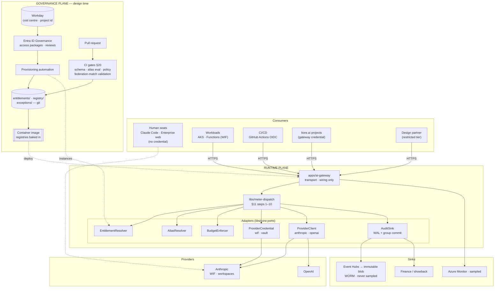
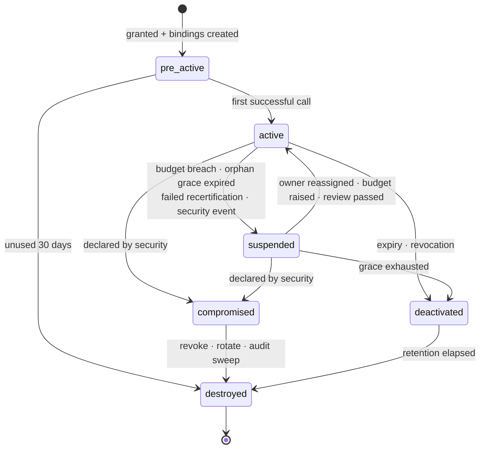
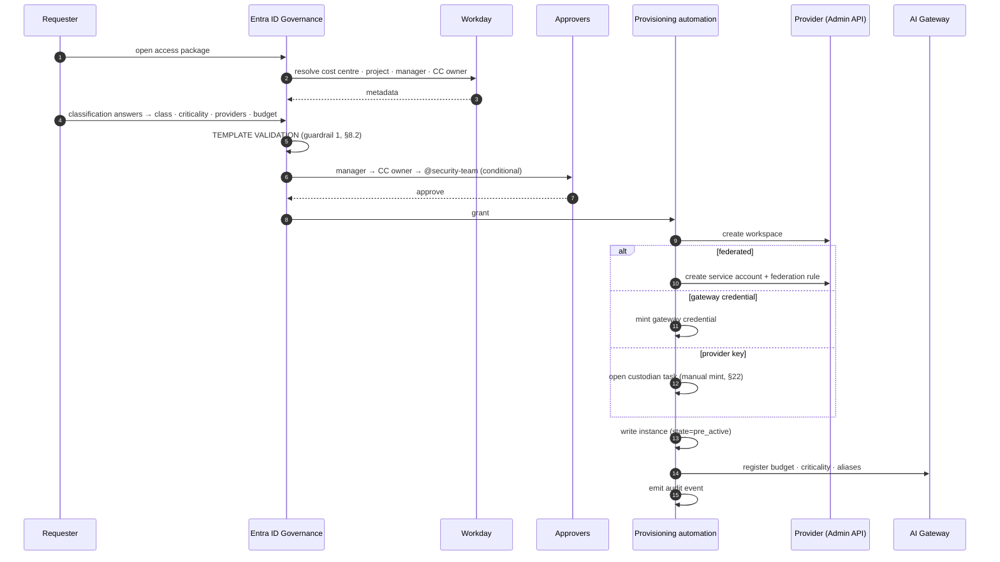

# AI API Credential Operating Model — Design

**Date:** 2026-09-04
**Status:** Draft for review
**Scope:** The credential control plane for consuming AI providers
**Sibling:** `2026-09-04-mcp-gateway-design.md`

---

## 1. Purpose

Define how identities — human and non-human — obtain, hold, and lose the ability
to call AI providers and spend money doing so, such that every call is
attributable to a named accountable human and a Workday cost centre.

The organisation has approved platforms, named ownership, least privilege, and
governance for external connections. It does **not** have an operating model for
AI API credentials. This document supplies it.

Five questions define the deliverable:

1. How do employees obtain company-managed API access instead of using personal
   API keys?
2. Who owns provisioning, rotation, revocation, auditing, and spend governance?
3. How does API access work for agents, MCP servers, automations, and CI/CD?
4. How do external design partners reach AI-enabled capabilities?
5. How is a vendor-neutral posture maintained across Claude, OpenAI, and future
   providers?

---

## 2. Relationship to the MCP Gateway

The two specs are siblings. Neither subsumes the other.

| | MCP Gateway | This spec |
|---|---|---|
| Direction | agent → enterprise services | human/agent → AI providers |
| Governs | what an identity may **do** | what an identity may **call and spend** |
| Credential shape | Entra OBO, short-lived, none stored | provider credentials — long-lived bearer secrets by default |
| Failure posture | fail closed, uniformly | **graduated by criticality** (§16) |
| Content logging default | `hashed` | **`none`** (§15.3) |

**Inherited unchanged:** Entra ID as IdP, Azure, Key Vault, Cedar behind a port,
YAML-in-git under CODEOWNERS, OTel plus never-sampled WORM audit, ports and
adapters with `import-linter` enforcement, and principles P1–P7.

**Shared, not duplicated:** an agent registers **once**. Both gateways resolve
the same `AgentIdentity` and `trust_tier` from `libs/core`. They remain separate
runtime planes (C11, §5.2).

**Not in conflict with §18 of the sibling.** That spec defers *Workday as a
runtime destination* behind field-level authorization. This spec uses Workday as
a **governance-plane** metadata source at provisioning time, never in the request
path — the same trust boundary as the Orchestrator. A reviewer should not read
these as the same integration.

---

## 3. Principles

P1–P7 from the sibling spec apply in full. Five more are specific to credentials.

1. **C-P1 — The entitlement is the unit of governance, not the credential.**
   A secret is an implementation detail of an entitlement. This is what makes
   "no human holds a key" coherent rather than merely restrictive, and it is why
   `binding` (§7.2) is an *output* of provisioning rather than a separate path.
2. **C-P2 — Every entitlement has exactly one accountable human at all times.**
   Orphaning is structurally impossible, not discouraged by policy.
3. **C-P3 — Prefer eliminating a secret to managing one.**
   Federation beats rotation; rotation beats vaulting; vaulting beats
   distribution. Every step down the ladder is a declared, expiring, counted
   exception (§9.2).
4. **C-P4 — Make the sanctioned path the easiest path.**
   Enforcement without a better alternative produces shadow usage, not
   compliance. This is a delivery-ordering constraint, not a slogan (§21.3).
5. **C-P5 — Attribution is recorded at request time, never reconstructed from
   invoices.** A provider invoice cannot be attributed after the fact, which is
   why metering lives in the request path (§13).

### 3.1 On NIST CKMS

An earlier framing proposed conformance to NIST SP 800-130. **This spec makes no
CKMS conformance claim,** because a provider API key is a bearer secret: it has
no algorithm, no key strength, and no crypto period in the SP 800-57 sense.
Applying the framework to it would produce ceremony that overstates the
guarantee, violating P4.

Two ideas are borrowed without the label, because both are genuinely useful:

- the **credential state machine** (§7.3), and
- the separation of **credential custodian** from **credential owner** (§6).

The one place real cryptographic key governance belongs is **CMEK** (§19), where
an external KMS key with a genuine lifecycle is attached to a provider workspace.

---

## 4. Decision record

| # | Decision | Choice | Rationale |
|---|---|---|---|
| C1 | Egress topology | Mandatory AI Gateway as sole egress; the gateway itself authenticates to Anthropic by **workload identity federation**, holding no long-lived provider credential | Makes ownership and spend properties of an identity, not of a secret. WIF removes the last static key (§9.1) |
| C2 | NIST CKMS | **No conformance claim.** Borrow the state machine and custodian/owner split only | §3.1 |
| C3 | Provisioning front door | Entra ID Governance access packages; Workday authoritative for cost centre and project ID | Recertification, expiry and joiner-mover-leaver are native; Workday→Entra HR-driven provisioning is a supported integration |
| C4 | Human credential | **None issued, ever.** SSO seats; `claude_code_user` role where Claude Code is the need | Disabling the Entra account *is* the revocation. `claude_code_user` grants Claude Code without API-key management |
| C5 | Workload auth | OIDC federation by default; static-credential exception register for the remainder | C-P3. The register is a metric to drive down and the artefact for an auditor |
| C6 | Ownership | One accountable individual + **automatic** cost-centre-owner fallback | C-P2 |
| C7 | Ceiling behaviour | Tiered by declared `criticality`: `interactive` \| `batch` \| `production` | One global rule either causes outages or leaves agents unbounded |
| C8 | Top-ups | Always approver-gated; engineering effort goes into approval **latency** | User decision. Mitigated by actionable cards, an SLI, and delegate escalation (§14) |
| C9 | Seats vs API | Workload class decides; provisioning refuses an API entitlement for plainly interactive use | The guardrail lives in the tool, not in a policy document |
| C10 | Vendor neutrality | Native provider protocols + git-governed **model alias registry**, eval-gated | Reduces switching cost without lowest-common-denominator feature loss (§10) |
| C11 | Agent identity | Shared registry and `AgentIdentity`; **two separate runtime planes** | Correlation without a shared outage domain (§4.2) |
| C12 | Shadow AI | Network egress deny-by-default, allowlist generated from the provider registry | Makes "mandatory" a property of the network. Managed estate only — stated as a limit (§12) |
| C13 | kore.ai | A governed **consumer**: per-project gateway credential, one provider workspace per project | Per-project *provider keys* would require Console work per project (§22). This keeps provisioning self-service and removes any second egress path |
| C14 | Sub-attribution | Caller-asserted end user recorded with a `derived`/`declared`/`granted` attestation tier | Reuses sibling §9.1. Throttle on an assertion; never authorize on one (§9.3) |
| C15 | Provider tenancy | One provider workspace per entitlement, created programmatically | The workspace is the native unit of rate limiting, cost reporting and CMEK — isolation, throttling and chargeback land on one object |
| C16 | Revocation verbs | Three, all programmatic: key deactivation, federation-rule/service-account archive, workspace archive | Issuance is partly manual; **revocation never is**. The emergency path is never blocked on a human |
| C17 | Burn-rate breaker | A rolling-window circuit breaker independent of budget, applying to **every** criticality | A monthly budget cannot catch a runaway that burns a month in twenty minutes (§13.3) |

---

## 5. Architecture

### 5.1 Component view

Two planes, as in the sibling spec. The **governance plane** is design-time and
never in the request path; the **runtime plane** never writes to git.



Note that **human seats bypass the gateway entirely** and reach the provider
directly. That is not a gap: a seat carries no credential, its cost is a fixed
per-person charge to the holder's cost centre, and its revocation is the Entra
account. Routing seats through a proxy would add a tier-0 dependency in exchange
for telemetry the provider already reports.

### 5.2 Two planes, one identity

```
AgentIdentity  ← libs/core, shared by both gateways
   ├── MCP Gateway   → what tools it may invoke
   └── AI Gateway    → what models it may call, and what it may spend
```

They are **not** merged into one runtime, for two reasons. Their traffic shapes
are opposite — model egress is high-throughput long-lived streaming, tool
invocation is low-throughput and policy-heavy — so one scaling profile fits
neither. And merging places all inference behind Cedar evaluation and Entra
group-cache freshness, converting an authorization staleness event into a
company-wide inference outage.

Correlation is achieved instead by shared `trace_id` and `intent.id` (§15.4).

---

## 6. Roles and accountability

| Role | Who | Accountable for |
|---|---|---|
| **Entitlement owner** | named individual | justification, model choice, budget, answering alerts |
| **Cost-centre owner** | resolved from Workday | approving budget and top-ups; **automatic fallback owner** |
| **Credential custodian** | AI Platform team | issuance, rotation, revocation *mechanics* |
| **Security** | `@security-team` | templates, exception register, provider onboarding, policy |
| **Provider owner** | AI Platform | contract, DPA, retention terms, price table, alias registry |

The load-bearing separation, borrowed from CKMS: **the custodian never decides
who gets access, and the owner never touches secret material.** Neither role
alone can grant itself spend. This is enforced by CODEOWNERS on
`entitlements/templates/**` and `exceptions/**`, not by convention.

---

## 7. The entitlement model

### 7.1 Templates and instances

Two objects, mirroring the governance/runtime split.

| | Entitlement **template** | Entitlement **instance** |
|---|---|---|
| Where | `entitlements/templates/*.yaml` in git | platform datastore |
| Governed by | CODEOWNERS PR | Entra access package grant |
| Contains | what may be requested, and its bounds | one granted entitlement, with lifecycle state |
| Changes | reviewed | operational |

Templates **narrow**; instances never widen. A request that cannot be satisfied
within its template's bounds is a template change, which routes to
`@security-team` — the same rule as `configSchema` in the sibling spec.

### 7.2 Instance schema

```yaml
id: ent-7f2a
template: workload-inference-standard
principal:
  type: workload | human_group | platform_project | partner
  ref: <entra object id | federation rule id | kore project id>
owner:
  accountable: alice@example.com
  fallback: resolved-at-read-time-from-workday   # never a stale stored copy
workday:
  cost_centre: CC-4471
  project_id: PRJ-10023
providers: [anthropic]
model_aliases: [reasoning-heavy-v1]
tenancy:
  anthropic_workspace_id: wrkspc_...             # §C15
criticality: interactive | batch | production
budget:
  amount_monthly: 2000
  currency: USD
  version: 3                                     # incremented by each top-up
binding: federated | gateway_credential | provider_key   # an OUTPUT (C-P1)
state: pre_active | active | suspended | deactivated | compromised | destroyed
expires_at: 2027-03-04
```

`binding` being an output is the point of C-P1: the front door is identical
whether the result is a WIF rule, a gateway credential, or a vaulted key.

`owner.fallback` is **resolved at read time**, never stored. A stored copy goes
stale exactly when it matters — during a reorg.

### 7.3 Lifecycle



Every transition has a mechanical trigger, not a policy sentence:

| State | Meaning | Entered by |
|---|---|---|
| `pre_active` | approved and minted, never used | provisioning completes all bindings |
| `active` | in use | first successful call |
| `suspended` | **reversible** stop | budget breach (except `production`), orphan grace expired, failed recertification, security event |
| `deactivated` | credential invalid, audit retained | expiry or revocation. Recoverable only by a new request |
| `compromised` | declared by security | immediate revoke, forced rotation, audit sweep on `trace_id` |
| `destroyed` | material gone, record retained | retention elapsed, or unused-`pre_active` timeout |

`pre_active` auto-destroying after 30 days unused quietly kills the "requested
it, never needed it" long tail without anyone running a campaign.

Orphan handling deliberately reaches `suspended`, not `deactivated`. The
alternative is someone breaking production to enforce paperwork.

### 7.4 Joiner–mover–leaver

Driven by Workday → Entra, not by a manual process.

- **Leaver.** Entra account disabled → human access ends immediately, with
  nothing to clean up. This is C4 paying for itself.
- **Owned entitlements.** Ownership moves to the cost-centre owner
  *immediately*; a reassignment task opens; after a **14-day grace** an
  unclaimed entitlement **suspends**.
- **Mover.** A cost-centre change flags the entitlement. The receiving
  cost-centre owner must re-affirm at the next review or it suspends.
- **Recertification.** Entra access reviews — quarterly for partner and
  `restricted` tier, semi-annual otherwise. Non-response suspends.

---

## 8. Provisioning

### 8.1 Flow



### 8.2 Guardrail 1 — template validation

The provisioning tool refuses, before any approver sees the request:

- an **API entitlement for a plainly interactive class** (C9);
- `criticality: production` without a named on-call rota;
- a partner template without a DPA reference or an end date;
- a GitHub Actions federation rule matching a **bare repository** (§9.4);
- a model alias not permitted by the template;
- a budget above the template's ceiling without a `@security-team` approver in
  the chain.

### 8.3 Guardrail 2 — automation is the only minting path

No human can mint a gateway credential or create a federation rule outside
provisioning automation. Where a provider key must be created by hand (§22),
automation opens a **custodian task**; the custodian mints and registers it, and
cannot self-approve the entitlement that consumes it (§6).

### 8.4 Partial failure converges

If a workspace is created but the credential mint fails, the entitlement stays
`pre_active` and a reconciler retries. **Nothing reaches `active` without every
binding present** — the sibling spec's §14 rule that a partial success is never
reported as a success, applied to provisioning.

---

## 9. Access patterns

### 9.1 Humans — a seat, never a credential

| | |
|---|---|
| Granted | provider org membership via the access package; role `claude_code_user` (Claude Code without API-key management) or `user` |
| Surfaces | Claude Code, Claude Enterprise web, internal chat UI |
| Credential | **none** |
| Attribution | fixed per-seat cost to the holder's Workday cost centre; no metering required |
| Revocation | Entra account disable; org member removal is hygiene, not the control |

**The seat top-up seam.** Seat allowances are enforced by the provider, so on the
face of it "request more" would send people to a provider portal — the
disjointed experience this model exists to avoid. Claude Enterprise exposes
**spend-limit endpoints** (raw HTTP, not in the SDKs). If those behave as named,
the top-up request lives entirely in our flow with the cost centre pre-filled.
**This is verification item V3 (§22)**; until it resolves, seat top-ups link out,
and the spec says so rather than implying otherwise.

### 9.2 Workloads — the federation ladder

Three rungs. **Every step down requires a declared reason** (C-P3).

| Rung | Mechanism | Approval | Used by |
|---|---|---|---|
| 1 | **Federated, no secret** — OIDC WIF, `token_lifetime_seconds: 600` | entitlement only | AKS, Functions, GitHub Actions |
| 2 | **Gateway credential** — minted, auto-rotated, scoped to one entitlement and workspace | entitlement only | kore.ai projects, SaaS that can send a header |
| 3 | **Provider key** — held in Key Vault | **exception register entry** | providers with no federation, tools that cannot use the gateway |

The gateway reaches Anthropic on rung 1 using its own Azure workload identity,
so **no long-lived Anthropic credential exists at any layer** (C1).

Exception register — `exceptions/*.yaml`, `@security-team`:

```yaml
- id: exc-0007
  entitlement: ent-7f2a
  reason: "connector cannot present an OIDC assertion"
  binding: gateway_credential
  owner: alice@example.com
  rotation_interval_days: 90
  expires_at: 2027-03-04        # MANDATORY, capped at 12 months
  review: quarterly
```

An exception with no expiry is a decision wearing an exception's clothes. Open
exception count is a platform metric, reported quarterly.

### 9.3 Sub-attribution — throttle on an assertion, never authorize on one

Tiers reused verbatim from sibling §9.1.

| Tier | Source | Chargeback | Rate limiting | **Authorization** |
|---|---|---|---|---|
| `derived` | gateway infers; no end user known | entitlement only | entitlement only | no |
| `declared` | platform asserts an end-user id in a header | yes, if `trust_tier` ∈ {`trusted`, `internal`} | yes | **never** |
| `granted` | verified OBO token | yes | yes | yes |

The distinction is counterintuitive and is what makes `declared` safe:
**rate-limiting a liar harms only the liar; authorizing one is privilege
escalation.** So kore.ai gets per-end-user throttling and per-user chargeback
inside a shared credential, and zero authorization influence from that header.

A `restricted`-tier partner's assertions are recorded and used for neither.

### 9.4 CI/CD — one detail that is a security bug if missed

A federation rule must match on **ref or environment**, never on repository
alone:

```yaml
match:
  subject_prefix: "repo:my-org/my-repo:environment:production"
  claims: {repository_owner: my-org}
```

A repository-only match permits any branch — and, depending on configuration,
any fork pull request — to mint production inference credentials. This is
validated in the provisioning template (§8.2) and in CI, not written in a
runbook.

---

## 10. Vendor neutrality — the model alias registry

The only place a provider model ID appears.

```yaml
# registry/aliases/reasoning-heavy-v1.yaml        @ai-platform @security-team
alias: reasoning-heavy-v1
description: Long-horizon analysis, tool use, code generation
routes:
  - provider: anthropic
    model: claude-opus-5
    params: {thinking: adaptive, effort: high}
fallback:                          # DECLARED — never implicit
  - provider: anthropic
    model: claude-opus-4-8
    on: [refusal]
data_policy:
  zero_retention_required: true
  allowed_classifications: [public, internal, confidential]   # not pii
eval:
  corpus: evals/reasoning-heavy-v1
  min_score: 0.82
```

Three deliberate properties:

**Automatic cross-provider failover is forbidden.** Silently serving a different
model changes behaviour without telling anyone — a direct P4 violation. Failover
is declared, condition-scoped, and the audit records which route actually served.

**`allowed_classifications` is the data-governance hook**, reusing the sibling's
vocabulary. An alias can be structurally forbidden for `pii`.

**`eval.min_score` is what makes neutrality real.** Repointing an alias is a PR
that must clear its eval corpus in CI. Stated honestly, per P4: this reduces
switching cost, it does not eliminate it — prompts tuned to one model do not
transfer, and the eval is what makes the residual cost *visible* rather than
absent. An alias without a corpus fails the build (§20).

---

## 11. Request lifecycle

```
consumer                AI GATEWAY (apps/ai-gateway = wiring only)          provider
   │
   │ 1. authn ───────►  WIF assertion | Entra token | gateway credential
   │                    → Principal + entitlement ref
   │
   │                  2. EntitlementResolver (cached: TTL + hard max-staleness)
   │                       deny if suspended | deactivated | expired
   │                  3. AliasResolver → route + params
   │                       deny if alias ∉ entitlement.model_aliases
   │                  4. classification vs alias.allowed_classifications
   │                  5. BudgetEnforcer per criticality (§13) + burn-rate breaker
   │                  6. AuditSink.open()  ◄── durable (group commit) BEFORE egress
   │                  7. ProviderClient.execute() ─────────────────────────► call
   │                  8. capture provider-reported usage  ◄──────────── stream
   │                       (captured even on client abort)
   │                  9. meter → budget decrement → cost centre attribution
   │                 10. AuditSink.close()
   │  ◄──────────────── streamed response
```

Four properties that are choices, not implementation details:

**Step 6 precedes step 7**, for the same reason as the sibling's I1 and arguably
a stronger one: step 7 is data leaving the boundary to a third party. Per-request
`fsync` at inference QPS is handled by **group commit** — a request is held until
its batch commits, so the guarantee holds at a bounded few-millisecond
granularity rather than per record. Stating the granularity is P4.

**Step 8 matters more than it looks.** Token counts arrive with the provider's
final usage. If a client disconnects mid-stream the cost is still owed, so
metering reads provider-reported usage rather than what was relayed.

**Step 5 runs two independent checks.** Budget (§13.2) and burn rate (§13.3) are
different controls; a monthly budget cannot catch a twenty-minute runaway.

**Steps 2–10 live in `libs/meter-dispatch`, not in the app.** If they cannot be
moved there, the boundary has leaked.

---

## 12. Enforcing "mandatory"

A policy document does not stop a personal API key. Network egress does.

Provider API domains are blocked at the egress proxy and firewall for every
source except the gateway's egress identity. **The allowlist is generated from
`registry/providers/`**, so onboarding a provider and opening its egress are the
same reviewed change — they cannot drift.

**Stated limit, deliberately not buried.** This holds on the managed network and
managed devices only. A personal laptop on home wifi is outside this control.
The mitigating control is not technical: it is C-P4 — seats (§9.1) must make the
sanctioned path genuinely easier than the unsanctioned one. This is why §21.3
forbids shipping the egress block before the seats.

Complementary controls, owned outside this platform and named here so the gap is
explicit rather than assumed closed: SSE/CASB visibility, and a procurement
control on reimbursement for personal AI subscriptions.

---

## 13. Cost

### 13.1 Computed, not reconciled

Cost is derived at request time from provider-reported usage × a **git-governed
price table** (`registry/pricing/`). The audit event records the **price-table
version**; without it, no number can be reproduced three months later and every
dispute becomes archaeology.

Monthly reconciliation compares gateway-computed spend against the provider
invoice **per workspace** — which C15 makes a direct comparison rather than an
allocation exercise. Variance beyond threshold **alarms**. It is never silently
adjusted.

### 13.2 Enforcement by criticality

| `criticality` | 80% | 100% | 120% |
|---|---|---|---|
| `interactive` | notify owner | **deny** + top-up link | remains denied |
| `batch` | notify owner | throttle | deny + top-up link |
| `production` | notify owner + CC owner | throttle + page on-call | **no automatic deny** — a human decides, recorded as an audit event |

The `production` row is bounded by a *decision* rather than a timer. That is not
the same as unbounded, and the distinction is written here because a reader will
otherwise object to it.

### 13.3 Burn-rate circuit breaker (C17)

Independent of budget and applying to **every** criticality including
`production`: if spend across a rolling window exceeds a configured multiple of
the trailing baseline, throttle and alert regardless of remaining budget.

This is the control that makes runaway agents survivable. Budgets are monthly; a
looping agent burns a month in twenty minutes and every budget threshold fires
at once, far too late to matter.

### 13.4 Visibility

Showback by cost centre, project, entitlement, and — at `declared` tier —
end user. Owners see their own; cost-centre owners see their centre; finance
sees all.

---

## 14. Top-ups

Approver-gated in every case (C8). The design effort goes into **latency**, not
into bypasses.

1. The denial carries the reason, current spend, and a **signed top-up link**
   (AI-I9).
2. The link opens a pre-filled access-package request: entitlement, current
   spend, burn rate, trailing three-month spend, requested increase.
3. Routed to the cost-centre owner as an actionable card, with an **SLA** and
   **auto-escalation to a delegate**, so one person on holiday cannot stall a
   team.
4. Each grant emits an audit event and increments `budget.version`.

**Median time-to-approval is a named platform SLI.** If it degrades, C-P4 fails
and people find another way — so the metric is the early warning for the whole
operating model, not a service-desk statistic.

---

## 15. Traceability

### 15.1 Two sinks

As in the sibling spec: OTel traces (sampled, short retention, debugging) and an
audit log (never sampled, long retention, WORM immutable blob with legal hold).
Correlated by `trace_id`.

### 15.2 Audit event

```yaml
record:      {id, seq, writer_id}
trace_id:    ...
intent_id:   ...                                  # correlates to MCP Gateway
phase:       open | close
principal:   {type: human|workload|platform|partner, sub, auth_method}
agent:       {client_id, name, trust_tier}        # shared AgentIdentity (C11)
entitlement: {id, template, state, criticality}
end_user:    {id, attestation: derived|declared|granted}   # §9.3
workday:     {cost_centre, project_id}
alias:       {name, registry_version}
route:       {provider, model, workspace_id, served_by_fallback: bool}
request:     {classification, stream: bool}
decision:    {outcome, reason, determining_control}
usage:       {input_tokens, output_tokens, cache_read_tokens, ...}  # close only
cost:        {amount, currency, price_table_version}                # close only
payloads:    {prompt_hash, response_hash}         # per payload_logging
outcome:     {status, provider_status, latency_ms, error_class}     # close only
clock:       {opened_at, closed_at}
```

### 15.3 Content logging is stricter than in the sibling spec

Same `payload_logging: none | hashed | full` vocabulary, **different default:
`none`.**

The sibling defaults to `hashed` because a tool argument is a worker ID. An
inference prompt may be an entire contract. Token counts, model, latency, cost,
and hashes are always recorded; content only where a template declares `full`
**and** the data classification justifies it. Security-owned, as before, and
never settable on an instance.

### 15.4 Cross-gateway correlation

Both gateways emit `trace_id` and `intent.id`. The joint query neither can answer
alone —

> *this agent, under intent `i-8f3a`, spent $40 across 12 model calls and read
> worker `W-10423`*

— is a join on `intent.id` across the two WORM logs. This is the concrete payoff
of C11 and it is an **acceptance test** (§21.2, T2), not an aspiration.

---

## 16. Degradation

The sibling fails closed uniformly, because an unauthorized action on HR data is
worse than no action. Applied naively here, a metering blip stops all inference
company-wide — and a platform that does that is routed around within a quarter,
which is what P5 actually warns about.

**Degradation is graduated by `criticality`, reusing C7 rather than inventing a
second axis.**

| Component fails | `interactive` / `batch` | `production` |
|---|---|---|
| Entitlement store stale past max-staleness | fail closed | **fail closed** — identity is not negotiable |
| Budget/metering store unreachable | fail closed | **continue**, buffer locally, reconcile on recovery |
| Audit sink (remote) unreachable | continue on local WAL, drain async | same |
| Audit WAL unwritable | pod unready | pod unready |
| Alias registry unloadable | deploy-time failure — pod never becomes ready | same |
| Provider unavailable | surface honestly; **no silent failover** | same |

The bounded risk in the single open cell is exactly the traffic C7 already
declines to hard-block. That is what makes it a principled exception rather than
a hole.

### 16.1 Fail loudly

`GovernanceHealth` drives `/readyz` and appears in the error body, as in the
sibling spec:

```json
{
  "error": "governance_unavailable",
  "governance_health": {
    "wal_writable": true,
    "alias_registry_loaded": true,
    "entitlement_cache_fresh": false,
    "entitlement_cache_age_s": 812,
    "entitlement_cache_max_staleness_s": 600,
    "metering_degraded": false
  },
  "trace_id": "..."
}
```

### 16.2 `just explain`

Extended to this gateway, answering "why was I denied?" and "what did this
cost?" authoritatively from the audit record — entitlement state, budget
position, burn rate, determining control, price-table version.

---

## 17. Invariants

The named suite. These **are** the guarantee.

```
AI-I1  No provider egress occurs without a preceding durable audit open
AI-I2  Every entitlement attributes to exactly one Workday cost centre at all times
AI-I3  An asserted end-user identity never affects an authorization decision
AI-I4  No egress reaches a provider absent from the provider registry
AI-I5  An alias resolves only to routes declared at the deployed git SHA
AI-I6  Usage is metered from provider-reported usage, including on client abort
AI-I7  Content is never persisted above the declared payload_logging fidelity
AI-I8  A suspended or deactivated entitlement cannot egress
AI-I9  Every deny carries a reason, a remediation, and a trace_id
AI-I10 No entitlement reaches `active` with an incomplete binding set
AI-I11 No long-lived provider credential exists outside the exception register
```

AI-I9 is inherited deliberately: for budget denials the remediation **is** the
top-up link, which is what makes C8's approver-gated flow tolerable rather than
merely strict.

AI-I11 is the mechanical form of C-P3 — it is testable by enumerating Key Vault
secrets and the register and asserting the sets match.

---

## 18. External design partners

A distinct template, `partner-design-v1`, which the provisioning tool will not
allow to be assembled by hand:

- mandatory **DPA reference** and a **fixed end date** — no open-ended partner
  entitlement can exist;
- **zero-retention aliases only**; `pii` classification structurally unavailable
  via `allowed_classifications`;
- hard spend cap, `trust_tier: restricted`, dedicated workspace (C15) with its
  own rate limits;
- top-ups route to the cost-centre owner **and** `@security-team`; no
  fast path applies;
- assertions recorded, never trusted; `granted` tier unavailable;
- ingress separate from internal, via Entra External ID;
- **exit is automatic** on the end date: workspace archive plus entitlement
  `deactivated`, with no human action required.

Composition analysis in CI asserts the third and fourth bullets statically, in
the same manner as the sibling's surface/audience checks.

---

## 19. Deferred subsystems

Triggers are written so deferral cannot become indefinite by default.

| Subsystem | Trigger | Notes |
|---|---|---|
| `granted` end-user tier | First consumer that can perform the exchange **and** needs per-end-user authorization | The tier value is already reserved in the schema (§9.3), so enabling it is not a breaking change |
| Prepaid quota / burst pools | When approval latency (§14 SLI) is measured as the top platform complaint | Deliberately measured, not assumed |
| Automated provider key minting | If and when a provider exposes programmatic key creation | Tracks V1 (§22) |
| Bedrock / Vertex / Foundry routing | First model requirement not servable from Anthropic direct | The `ProviderClient` port already accommodates it |
| **CMEK** | First workload with a contractual customer-managed-encryption requirement | The one genuine cryptographic key lifecycle in this system (§3.1). External key registered and attached per workspace |
| Semantic caching / cost-optimising router | When cache-eligible traffic is measured above a set share | A router that changes model selection needs the eval gate first |
| Prompt-content DLP | **Before** any `payload_logging: full` template exists, or before `pii` is permitted on any alias | A hard precondition, not a wish |
| Self-service alias authoring | After the eval gate exists and ≥5 aliases are hand-authored | Mirrors the sibling's UI-after-eval rule |
| Short-lived personal tokens | First tool that can neither do OIDC nor use a seat | Rejected as a default in C4; kept as a specified fallback |

---

## 20. CI/CD and the governance pipeline

```
PR opened
  ├─ structural validation (JSON Schema) — templates · aliases · providers · exceptions
  ├─ cross-layer validation
  │     every alias has an eval corpus            → else FAIL
  │     every alias route names a registered provider
  │     every exception has expires_at ≤ 12 months
  │     no template permits pii on an alias lacking that classification
  │     no federation match is repository-only (§9.4)
  ├─ alias eval gate: repointed alias must clear eval.min_score
  ├─ partner composition analysis (§18)
  ├─ egress allowlist generation diff (§12) — provider registry ↔ firewall config
  ├─ unit + fixture + invariant suites (§17)
  ├─ import-linter (architecture)
  └─ CODEOWNERS routing by path

merge → build image (registries baked in) → rolling deploy
```

Registries are **baked into the image**, so the running image digest maps to
exactly one git SHA and `alias.registry_version` in the audit record is
unambiguous.

---

## 21. Delivery

### 21.1 Scope

In scope: the gateway runtime, the four registries, provisioning automation,
metering and enforcement, seats, egress blocking, kore.ai onboarding, partners.

Out of scope: everything in §19.

### 21.2 Tranches

| | Tranche | Newly verifiable |
|---|---|---|
| **T0** | Registries, schemas, CI spine, CODEOWNERS, `libs/core` extensions | An alias without an eval corpus fails the build; a repository-only federation match fails validation |
| **T1** | Gateway path: authn, entitlement + alias resolution, WIF egress to Anthropic, audit WAL | AI-I1, AI-I4, AI-I5, AI-I7, AI-I8. **No long-lived Anthropic credential exists anywhere** (AI-I11) |
| **T2** | Metering, price table, cost attribution, reconciliation, cross-gateway correlation | AI-I2, AI-I6. A cost is reproducible from its recorded price-table version; the §15.4 join returns a correct result |
| **T3** | Provisioning: access package, Workday resolution, automation, lifecycle states | AI-I10. Template validation refuses an interactive-class API entitlement; an orphaned entitlement suspends without human action |
| **T4** | Enforcement: criticality tiers, burn-rate breaker, denial + remediation, top-up flow | AI-I9. A `production` entitlement is never auto-denied; a simulated runaway throttles within the target window |
| **T5** | Seats, egress deny-by-default, kore.ai onboarding, sub-attribution | AI-I3. A kore.ai project provisions self-service end to end; personal-key egress is blocked on the managed estate |
| **T6** | Partners | A partner entitlement expires and archives with no human action |

Every invariant in §17 is claimed by exactly one tranche. An invariant with no
tranche is a guarantee nobody has agreed to build.

### 21.3 Sequencing rationale

Three choices a reviewer will reasonably question.

**T5's egress block cannot precede T1–T3.** Blocking the unsanctioned path before
the sanctioned one exists is C-P4 inverted, and it is the fastest available way
to make this platform unpopular before it is useful.

**Metering (T2) precedes enforcement (T4).** A budget that cannot be measured
cannot be enforced, and shipping enforcement on unvalidated metering produces
false denials — precisely the event that convinces people the gateway is not to
be trusted.

**Provisioning (T3) follows the gateway (T1), not the reverse.** It is tempting
to build the request flow first because it is the user-visible part. But the
entitlement schema is only empirical once something consumes it; building
provisioning against a speculative schema produces an access package that has to
be rebuilt.

### 21.4 Exit criteria

1. A workload authenticates by WIF, calls a model through an alias, and no
   long-lived Anthropic credential exists in Key Vault or the register.
2. The call's cost is attributed to a Workday cost centre and reproducible from
   its price-table version.
3. The §15.4 cross-gateway join returns the correct spend and resource set for
   one `intent.id`.
4. An entitlement whose owner is terminated in Workday transfers, then suspends
   after grace, with no human action.
5. A simulated runaway agent is throttled by the burn-rate breaker with budget
   remaining.
6. A `production` entitlement at 150% of budget is throttled and paged, never
   auto-denied.
7. A budget denial returns a reason and a working top-up link that lands
   pre-filled with the correct approver.
8. All eleven invariants pass; every guardrail test fails as expected.
9. A kore.ai project is created self-service and its spend appears against its
   own cost centre.
10. Personal-key egress to a provider domain is refused on the managed estate.

---

## 22. Verification items

Load-bearing facts that must be confirmed before implementation. Each is
recorded as an open question rather than an assumption, per P4.

| # | Item | Blocks | Owner |
|---|---|---|---|
| **V1** | Whether the Anthropic Admin API genuinely exposes no API-key **creation** (the reference lists `list` and `update` only). C13 and §8.3 assume creation is a Console action | T3, and the §19 deferral | AI Platform |
| **V2** | Whether kore.ai's custom LLM integration accepts an arbitrary endpoint plus header auth, **per project** | T5 | AI Platform |
| **V3** | Whether Claude Enterprise spend-limit endpoints permit programmatic seat-allowance adjustment (§9.1) | T5 seat top-up UX only | AI Platform |
| **V4** | Whether OpenAI's admin surface supports programmatic project and key creation, and whether it offers OIDC federation equivalent to WIF | T1 for the second provider | AI Platform |
| **V5** | Entra ID Governance access-package support for Workday-sourced custom attributes on the request form | T3 | Identity team |
| **V6** | Provider zero-retention terms confirmed in contract for every alias marked `zero_retention_required` | T6 (partners) | Provider owner + Legal |

V1 and V2 are the two that could change a decision. The remainder change effort,
not architecture.

---

## 23. What this spec does not claim

Per P4, stated plainly:

- **It is not NIST CKMS conformant** and does not claim to be (§3.1).
- **Egress control does not cover unmanaged devices** (§12). The mitigating
  control is C-P4, not technology.
- **Vendor neutrality reduces switching cost; it does not eliminate it** (§10).
  Prompts do not transfer between models. The eval corpus makes the residual
  cost visible.
- **`declared` end-user attribution is an assertion, not a verified identity**
  (§9.3). It is used for chargeback and throttling, never for authorization.
- **`production` traffic is bounded by a human decision and a burn-rate breaker,
  not by a hard budget ceiling** (§13.2).
