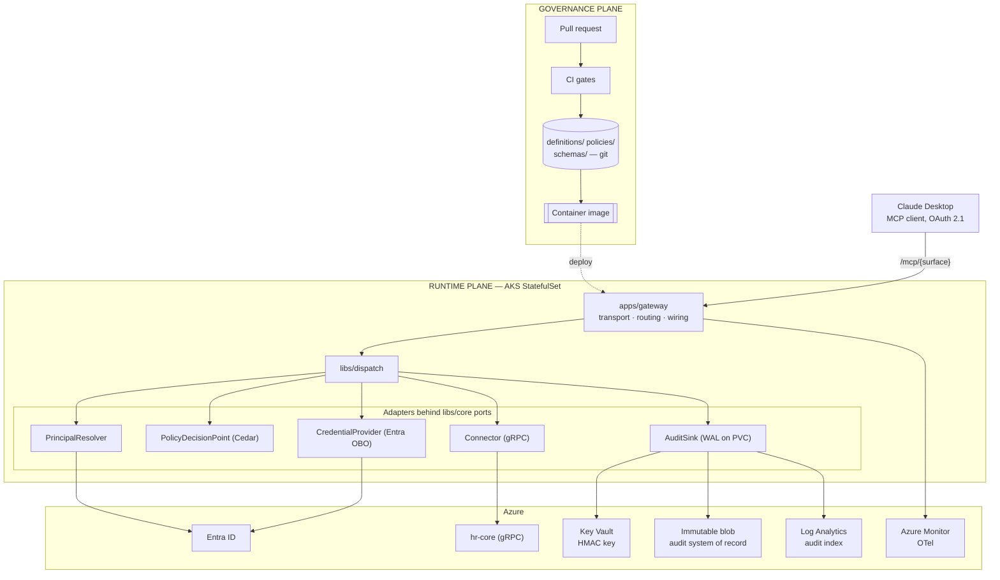

# MCP Gateway — Design

**Date:** 2026-09-04 (revised 2026-09-08)
**Status:** Approved for implementation planning
**Scope:** Slice one — a thin vertical slice through the Gateway

---

## 1. Purpose

Expose enterprise services to AI agents as MCP tools, such that every action is
governed by declaration and traceable end to end along the chain:

```
human → agent → intent → tool → resource → action → destination
```

The system has three subsystems. This document specifies the **Definition**
format and the **Gateway**. The **Orchestrator** (design-time LLM that proposes
definitions from proto/OpenAPI, never in the request path) is out of scope and
gets its own spec.

---

## 2. Principles

1. **Declare, don't infer.** Every element of the chain is a declared field in a
   definition, not something reconstructed from logs.
2. **Destinations enforce their own authorization.** The Gateway delegates the
   human's identity downstream; it never becomes the authority over data it does
   not own.
3. **Uncertainty resolves to deny, never to a human prompt.** An undecidable
   case is a policy gap to fix in git.
4. **Never claim a stronger guarantee than the mechanism delivers.**
5. **Fail closed, fail loudly, be trivially debuggable.**
6. **Enforce architecture in CI.**
7. **Adding a tool means adding data, not code.** One schema generates
   validation, types, docs, and review routing.

---

## 3. Decisions

| # | Decision | Choice |
|---|---|---|
| D1 | Build order | Thin vertical slice: two tools, one surface, one client, one destination |
| D2 | Destinations | Internal Azure services behind Entra only; the destination authorizes the human (P2) |
| D3 | Protocol | MCP revision `2026-07-28`, Streamable HTTP only, one route per surface; OAuth 2.1 validated on every request |
| D4 | Definitions | YAML in git, JSON Schema meta-schema, PR-gated by CODEOWNERS, baked into the container image |
| D5 | Policy | Cedar, in-process, behind a port; statically analysed in CI |
| D6 | Language | Python 3.12, FastAPI + FastMCP. A Go rewrite of dispatch happens only if measured Gateway p99 overhead exceeds 75 ms at production load |
| D7 | Identity | Gateway is an OAuth 2.1 resource server for Entra; downstream via Entra On-Behalf-Of; subject key is `(tid, oid)`; groups read from the token |
| D8 | Principals | **Human only** in slice one. Workload (mTLS) principals are deferred with the credential path they need |
| D9 | Intent | One tier: `derived`, one id per call, unsigned, recorded. Declared and granted intent arrive with the Enterprise SDK |
| D10 | Clients | Pre-registered Entra app registrations in `definitions/clients/registry.yaml` |
| D11 | Outcomes | `allow` or `deny(reason, remediation)`. Write access is standing Entra group membership. Escalation is deferred |
| D12 | Idempotency | Declared per write tool; the Gateway refuses a replay of a non-idempotent call within a short window |
| D13 | Traceability | OTel to Azure Monitor (sampled) **and** an audit log written ahead of every side effect to a local WAL, drained to immutable blob (never sampled) plus a Log Analytics index |
| D14 | Payload fingerprints | Keyed HMAC-SHA256 under a Key Vault key, never a bare digest |
| D15 | Tamper evidence | Azure immutable blob under a locked time-based retention policy. No application hash chains |
| D16 | Degradation | Fail closed. WAL on a per-pod PersistentVolume; a sink outage is not a traffic outage |
| D17 | Testing | Per-tool declarative fixtures plus a named invariant suite |

---

## 4. Components

### 4.1 Component view

Two planes. The governance plane is design-time and never in the request path.
The runtime plane never writes to git. The only coupling is the container image.



### 4.2 Component list

| Component | Kind | Responsibility | State |
|---|---|---|---|
| `apps/gateway` | Service | Streamable HTTP MCP server. One route per surface at `/mcp/{surface}`. Validates the OAuth token on every request. Composes adapters onto ports at startup. Contains no business logic. | none |
| `libs/core` | Library | Types (`Principal`, `AgentIdentity`, `IntentClaims`, `ToolCall`, `Resource`, `Action`, `Destination`, `Decision`, `AuditEvent`) and the five ports. Zero dependencies. | — |
| `libs/definition` | Library | Loads and validates definitions: JSON Schema, cross-layer rules (§5.7), gRPC descriptor checks. No I/O beyond reading files. | — |
| `libs/dispatch` | Library | Steps 5–11 of the request lifecycle (§12). The orchestration lives here, not in the app. | — |
| `libs/identity` | Library | `PrincipalResolver`: validates the Entra JWT, extracts `(tid, oid)`, `sub`, `groups`, `iat`. `CredentialProvider`: Entra On-Behalf-Of exchange using the pod's workload identity, one exchange per call. | none |
| `libs/policy` | Library | `PolicyDecisionPoint`: Cedar via Python bindings. Static analyser that proves named properties over the policy set in CI. | — |
| `libs/connectors` | Library | `Connector`: gRPC adapter that builds requests from committed descriptor sets and the declared field maps. | — |
| `libs/audit` | Library | `AuditSink`: append-only WAL with fsync, drain worker to immutable blob and Log Analytics, payload HMAC, OTel wiring. | WAL on PVC |
| `definitions/` | Data | Tools (five files each), destinations, surfaces, client registry. | git |
| `policies/` | Data | Cedar policy set and schema. | git |
| `schemas/` | Data | JSON Schema meta-schema; connector binding fragments. Source of every generated artifact. | git |
| `tools/fakes/` | Test substrate | Reference gRPC backend and a fake OIDC provider issuing Entra-shaped tokens. Normative for all tests. | — |
| `just explain` | Operator CLI | Reproduces the full chain and determining policy for a `trace_id` from the index or the local WAL. | — |
| Entra ID | External | Authorization server, OBO token exchange, `groups` claim. | — |
| Key Vault | External | One key: the payload HMAC key. | — |
| Immutable blob | External | Audit system of record, locked time-based retention. | — |
| Log Analytics | External | Queryable, non-authoritative audit index, shorter retention. | — |
| Azure Monitor | External | OTel traces, sampled. | — |
| `hr-core` | External | First destination. Internal gRPC service behind Entra. | — |

The Gateway has exactly **one** stateful runtime component: the WAL. There is no
database, no session store, and no credential cache.

### 4.3 Repository layout

```
libs/core/                  # PURE. Zero dependencies.
  types.py
  ports.py                  #   PrincipalResolver, PolicyDecisionPoint, CredentialProvider,
                            #   Connector, AuditSink
libs/definition/            # load, parse, validate
libs/policy/                # Cedar adapter + static analyser
libs/identity/              # PrincipalResolver, CredentialProvider (entra_obo)
libs/connectors/            # grpc
libs/audit/                 # AuditEvent, WAL, drain worker, HMAC, OTel
libs/dispatch/              # §12 steps 5–11

apps/gateway/               # MCP server: transport, routing, wiring only

definitions/
  destinations/<name>.yaml  # egress allowlist                   @security-team
  destinations/<name>.desc  # gRPC FileDescriptorSet, built in CI from the service proto
  tools/<service>/<tool>/   # prompt | interface | binding | governance | fixtures
  surfaces/<name>.yaml      # published MCP servers
  clients/registry.yaml     # client_id → agent, trust tier      @security-team
policies/                   # Cedar                              @security-team
schemas/
  connectors/grpc.json      # binding fragment, data not code
tools/fakes/
tests/
  invariants/
  guardrails/               # intentionally invalid definitions + expected error codes
```

### 4.4 Dependency rule

Every library depends on `libs/core` and only on `libs/core`. No library imports
another library. Only `apps/gateway` composes implementations onto ports, once,
at startup. Enforced by `import-linter` in CI; a violation fails the build.

Connector binding shapes are data in `schemas/connectors/` because both
`libs/definition` (validation) and `libs/connectors` (execution) need them, and
neither may import the other. Any future "one library needs another" pressure
takes the same shape: shared data, not an import.

---

## 5. The definition model

### 5.1 Five files per tool

| File | Contains | Blast radius | Owner |
|---|---|---|---|
| `prompt.yaml` | tool description, per-parameter descriptions | model behaviour | `@platform-dx` |
| `interface.yaml` | tool name, `inputSchema`, `outputSchema`, `configSchema`, `interface_version` | consumers | `@platform-eng` |
| `binding.yaml` | destination, connector, operation, field maps | where data goes | `@platform-eng` |
| `governance.yaml` | resource, action, classification, idempotency, payload logging, policies | what is permitted | `@security-team` |
| `fixtures.yaml` | declarative test cases (§15.3) | tests | `@platform-eng` |

### 5.2 Review routing

Path-based CODEOWNERS. No custom tooling; cannot be bypassed by a bot.

```
definitions/**/governance.yaml   @security-team
definitions/**/binding.yaml      @platform-eng
definitions/**/interface.yaml    @platform-eng
definitions/**/prompt.yaml       @platform-dx
definitions/destinations/**      @security-team
definitions/clients/**           @security-team
policies/**                      @security-team
schemas/**                       @platform-eng @security-team
```

### 5.3 Read tool

```yaml
# definitions/tools/hr/get_worker_profile/prompt.yaml
description: |
  Retrieve a worker's profile: legal name, worker id, department, and manager.
  Use when the user asks about a specific person's role or reporting line.
param_descriptions:
  worker_id: The worker's stable identifier, e.g. "W-10423".
```

```yaml
# interface.yaml
name: hr_get_worker_profile
interface_version: 1
inputSchema:                       # model-facing
  type: object
  additionalProperties: false
  required: [worker_id]
  properties:
    worker_id: {type: string, pattern: "^W-[0-9]{5}$"}
outputSchema:                      # the approved model — a ceiling, never a passthrough
  type: object
  additionalProperties: false      # required by validation
  properties:
    worker_id:     {type: string}
    legal_name:    {type: string}
    department:    {type: string}
    manager_id:    {type: string}
    manager_chain: {type: array, items: {type: string}}
configSchema:                      # operator-facing, set per surface
  type: object
  additionalProperties: false
  properties:
    include_manager_chain: {type: boolean, default: false}
```

```yaml
# binding.yaml
destination: hr-core               # must exist in definitions/destinations/
connector: grpc
operation:
  service: hr.v1.WorkerService     # must exist in hr-core.desc
  method: GetWorker
field_map:                         # inputSchema → request
  worker_id: request.worker_id
config_map:                        # configSchema → request
  include_manager_chain: request.expand_manager_chain
response_map:                      # response → outputSchema; undeclared fields are dropped
  worker_id:  response.worker.id
  legal_name: response.worker.legal_name
  department: response.worker.org.name
  manager_id: response.worker.manager.id
  manager_chain:
    from: response.worker.manager_chain[].id
    enabled_by: include_manager_chain    # dropped from output when false
```

```yaml
# governance.yaml
resource:
  type: worker
  id_from: input.worker_id         # omit for type-scoped operations such as list
action: read
data_classification: pii
payload_logging: hashed
policies: [hr.worker_read]
```

Config can only select a subset of the declared `outputSchema`: `config_map` on
the request side, `enabled_by` on the response side. Anything that would add a
field is an `interface.yaml` or `governance.yaml` change.

### 5.4 Write tool

```yaml
# definitions/tools/hr/update_worker_department/governance.yaml
resource: {type: worker, id_from: input.worker_id}
action: write
data_classification: pii
idempotent: false                  # required when action != read
payload_logging: hashed
policies: [hr.worker_write]        # must require a group (§5.7)
```

Write authorization is **standing**: the human must already hold the Entra group
the policy requires. A human who does not receives `deny` with a remediation.

### 5.5 Destinations

A `binding.yaml` may reference only a destination registered here.

```yaml
# definitions/destinations/hr-core.yaml                @security-team
name: hr-core
endpoint: hr-core.internal.example.com:443
protocols: [grpc]
descriptor: hr-core.desc
auth_profile:
  provider: entra_obo
  scope: api://hr-core/.default
```

### 5.6 Derived, never authored

| Derived | From |
|---|---|
| MCP `annotations.readOnlyHint`, `annotations.destructiveHint` | `governance.action` |
| MCP `annotations.idempotentHint` | `governance.idempotent` (`true` by construction for `read`) |
| `definition_version` | content hash of `prompt`, `interface`, `binding`, `governance` |
| Audit `resource`, `action`, `destination` | the declared fields |
| Python types, docs | `schemas/` |

### 5.7 Validation

1. **Structural** — JSON Schema.
2. **Cross-layer** — code in `libs/definition`:
   - every `field_map` key exists in `inputSchema`; every `config_map` key in `configSchema`;
   - every `response_map` key, including `enabled_by`-gated ones, exists in `outputSchema`;
   - every `enabled_by` names a boolean in `configSchema`;
   - `outputSchema.additionalProperties` is `false`;
   - `binding.connector` matches a fragment in `schemas/connectors/`, `operation` validates against it, and `service`/`method` exist in the destination's descriptor set;
   - `idempotent` is required when `action != read` and forbidden when `action == read`;
   - a `write` or `delete` tool with `data_classification: pii` declares at least one policy, and static analysis (§10.4) proves every such policy requires group membership;
   - `binding.destination` is registered;
   - every tool has `fixtures.yaml`;
   - every surface `audience` entry names a registered client.
3. **Static policy analysis** — §10.4.

### 5.8 Naming and versioning

- MCP tool name: `{service}_{operation}`, snake_case, unique per server. Validation asserts the MCP name rules (1–128 chars, `[A-Za-z0-9_.-]`).
- Surface ref: `{service}.{operation}`.
- `definition_version`: content hash, computed at build.
- `interface_version`: manual integer. CI diffs compiled `inputSchema`/`outputSchema` against the merge base and fails if an incompatible change did not bump it.

### 5.9 Vocabularies

Every enumerated field is closed. An unrecognised value is a validation error.

| Field | Values | Notes |
|---|---|---|
| `action` | `read` \| `write` \| `delete` | drives `readOnlyHint`/`destructiveHint` |
| `idempotent` | `true` \| `false` | required for `write`/`delete`; drives `idempotentHint` and retry (§11.3) |
| `data_classification` | `public` \| `internal` \| `confidential` \| `pii` | `pii` triggers the group-policy rule for writes |
| `payload_logging` | `none` \| `hashed` \| `full` | `hashed` = keyed HMAC (§13.4); default |
| `trust_tier` | `trusted` \| `restricted` | `trusted`: first-party. `restricted`: third-party. No `write`+`pii` tool may sit on a surface whose audience includes a `restricted` client |

### 5.10 MCP revision

Pinned as a constant and recorded in every audit event. Baseline `2026-07-28`.
Consequences relied upon here:

| Change in `2026-07-28` | Consequence |
|---|---|
| No protocol sessions; `tools/list` may vary by the authorization on the request | Authorization is per-request input. Per-principal tool filtering is spec-blessed |
| `initialize` replaced by `server/discover`; calling it is optional for clients | `instructions` is best-effort prose, never a control |
| `ttlMs` and `cacheScope` required on `tools/list` | A filtered list is `cacheScope: "private"`. `ttlMs` bounds how long a revoked tool stays visible |
| SSE resumability removed; clients must re-issue a broken request with a new id | Duplicate `tools/call` is normal client behaviour (§11.3) |
| OTel trace-context keys in `_meta` (`traceparent`, `tracestate`, `baggage`) | `trace_id` is the W3C trace id |
| Legacy HTTP+SSE deprecated | Streamable HTTP only |

Re-verify against the published spec at P7. Maintain `docs/mcp-compatibility.md`
as a client × capability matrix.

---

## 6. Surfaces

A tool is catalogue. A surface is a published MCP server. Configuration lives on
the surface, so one tool serves many surfaces.

```yaml
# definitions/surfaces/hr-assistant.yaml
name: hr-assistant
instructions: |
  You are operating against internal HR data. Confirm the worker's identity by
  reading their profile before proposing any change.
audience: [claude-desktop]                     # client names from clients/registry.yaml
tools:
  - ref: hr.get_worker_profile
    config:                                    # validated against configSchema
      include_manager_chain: true
  - ref: hr.update_worker_department
```

- Composition is a privilege change. Cedar evaluates it in CI against the
  audience's trust tiers (§5.9).
- Effective config is recorded in the audit event.
- Descriptions live on the tool, not per surface.
- `instructions` rides on `server/discover`, which clients may skip. Anything that
  must hold lives in `governance.yaml` and Cedar.

---

## 7. Client registry

MCP `2026-07-28` deprecates Dynamic Client Registration in favour of Client ID
Metadata Documents; Entra supports neither. Clients are pre-registered Entra app
registrations, declared in git.

```yaml
# definitions/clients/registry.yaml                    @security-team
clients:
  - client_id: 1f9c...            # Entra app registration
    name: claude-desktop
    trust_tier: trusted
    surfaces: [hr-assistant]
```

---

## 8. Identity

| Question | Answer |
|---|---|
| Who is the human? | Entra-issued OAuth token, validated on every request |
| Which agent is acting? | Registered `client_id` in the token |
| How do we act as the human downstream? | Entra On-Behalf-Of |

### 8.1 Subject key

The audit subject key is **`(tid, oid)`**. Entra `sub` is pairwise per
application, so the Gateway's `sub` and `hr-core`'s `sub` for the same person
differ and cannot be joined. `oid` is stable across applications; `tid`
disambiguates guests. `sub` is recorded as the value in the validated token.
`upn` and `preferred_username` are mutable and never recorded.

### 8.2 At the edge

The Gateway is an OAuth 2.1 **resource server**: it publishes RFC 9728
protected-resource metadata pointing at Entra, accepts only tokens whose
audience is the Gateway, and holds no user credentials.

**Named risk — RFC 8707 versus Entra.** MCP requires clients to send
`resource=<canonical MCP server URL>`. Entra requires `resource` to equal the app
registration's Application ID URI and rejects a mismatch. **Decision:** set the
Gateway app registration's Application ID URI to the Gateway's canonical HTTPS
URL (permitted on a verified custom domain) so both values are the same string.
This is verified by a spike against a real tenant in P5. If it fails, a thin
authorization-server broker in front of Entra enters scope at P5.

### 8.3 On-Behalf-Of

The Gateway exchanges the user's token for a downstream token
(`grant_type=urn:ietf:params:oauth:grant-type:jwt-bearer`,
`requested_token_use=on_behalf_of`, `scope=api://hr-core/.default`). It
authenticates as a confidential client with a **federated credential** from its
AKS workload identity; no client secret exists. One exchange per call; no cache.
The destination receives the human's identity and enforces its own rules.

Intent binding is Gateway-enforced only: the credential is obtained after a
policy `allow`, and no destination verifies intent claims. The audit record says
so.

### 8.4 Secrets

Key Vault holds one key: the payload HMAC key. Rotation is proactive; the key
epoch is recorded in every event.

---

## 9. Intent

Slice one has one intent tier, **`derived`**: the Gateway mints one intent id per
call and records `attestation: derived`. There is no honest way to group calls
from a vanilla client without agent cooperation, and inventing a grouping would
put a fiction into the audit record.

Per call, dispatch assembles `IntentClaims`:

```
principal      oid, tid, sub
agent          client_id, trust_tier
intent         {id, attestation: derived}
tool           {name, definition_version}
resource       {type, id}
action         read | write | delete
destination    service name
trace_id
```

`IntentClaims` is the Cedar `context` and is recorded verbatim in the audit
event. Declared intent via `_meta`, granted intent, and signed intent tokens
arrive with the Enterprise SDK and a destination that verifies them (§17.2).

---

## 10. Policy

### 10.1 Engine

Cedar, embedded in-process behind `PolicyDecisionPoint`. Its
principal/action/resource/context model maps onto the chain, it is not
Turing-complete so properties can be proven over the whole set, and it removes
the PDP from the runtime failure surface.

### 10.2 Mapping

```
principal  ← Principal, with Entra groups as Cedar groups
action     ← governance.action
resource   ← governance.resource.type + id_from
context    ← {agent: {client_id, trust_tier}, destination: {service},
              data_classification, surface, config}
```

Two decision shapes. The call-time decision has a concrete resource. The
`tools/list` visibility decision has no arguments, so it is type-scoped:

```
action     ← Action::"list"
resource   ← ResourceType::"worker"
context    ← as above, minus argument-derived fields
```

A `permit` on `Action::"list"` is a statement about a class of resources.

### 10.3 Policies

```cedar
permit (
  principal in Group::"HR-Core-Readers",
  action == Action::"read",
  resource is Worker
) when { context.agent.trust_tier == "trusted" };

permit (
  principal in Group::"HR-Core-Writers",
  action == Action::"write",
  resource is Worker
) when { context.agent.trust_tier == "trusted" };
```

### 10.4 Static analysis in CI

Cedar validation against the schema, then named properties over the policy set:

- every policy permitting `write` or `delete` on a `pii` tool requires group membership;
- no surface whose audience includes a `restricted` client contains a `write`+`pii` tool.

The report is a committed CI artifact.

### 10.5 Groups come from the token

The app registration sets `groupMembershipClaims: ApplicationGroup`, so the
access token carries only groups assigned to the application. There is no Graph
call and no cache; staleness is bounded by token lifetime, and `token_iat` is
recorded per call.

If a principal exceeds the claim limit Entra omits `groups` and emits
`_claim_names`. The Gateway **denies** with `groups_overage_unsupported` and a
remediation. The Graph fallback is deferred.

---

## 11. Decisions and errors

### 11.1 Outcomes

```
Decision = allow | deny(reason, remediation)
```

| Situation | Response |
|---|---|
| Agent missing an argument | structured error naming what is missing |
| Human lacks the permission | `deny` + remediation, e.g. "request group HR-Core-Writers" |
| Action needs a second authority | not in slice one; the tool is not published |

### 11.2 A deny is a tool result

MCP classifies policy and validation failures as *tool execution errors*, which
clients should give to the model; JSON-RPC errors are for malformed requests.
Every deny is therefore a `CallToolResult` with `isError: true`:

```json
{
  "resultType": "complete",
  "isError": true,
  "content": [{"type": "text",
    "text": "Denied: principal not in group HR-Core-Writers. Request the group at https://access.example.com/... (trace 4c1b9e2)"}],
  "structuredContent": {
    "error": "policy_denied",
    "reason": "principal not in group HR-Core-Writers",
    "remediation": {"request_group": "HR-Core-Writers", "via": "https://access.example.com/..."},
    "trace_id": "4c1b9e2..."
  }
}
```

| Failure | Wire form |
|---|---|
| Policy deny, validation failure, backend business error | `CallToolResult`, `isError: true` |
| Missing or invalid token | HTTP 401/403 with `WWW-Authenticate` |
| Unknown tool, malformed request | JSON-RPC error |
| `governance_unavailable` (§14.2) | JSON-RPC error |

### 11.3 Error classes, retries, duplicates

| Class | Behaviour |
|---|---|
| Validation | `isError`, remediation names the argument |
| Policy deny | `isError`, remediation names the group |
| OBO failure | one silent retry, then `isError` |
| Backend 5xx / timeout | `read` and `idempotent: true` retry once; otherwise surfaced as-is |
| Governance infrastructure | JSON-RPC error (§14) |

Clients replay `tools/call` after a broken stream, including mutating ones. The
Gateway computes `dedup_key = HMAC(tid, oid, client_id, tool, args_hmac)` and
records it. For `idempotent: false` tools, a repeat within **60 seconds** on the
same pod is refused with an `isError` naming the original `trace_id`. The window
is per pod and in memory; a replay that lands on another pod is not blocked, but
the recorded `dedup_key` makes it detectable after the fact.

If the backend wrote but the audit `close` failed, that is a distinct alarmed
state and the agent is not told "done". Every error carries `trace_id`.

---

## 12. Request lifecycle

```
consumer                 GATEWAY                                              backend
   │
   │ 1. EVERY request ►  validate OAuth token; PrincipalResolver → Principal
   │                     clients/registry.yaml → AgentIdentity + trust_tier
   │
   │ 2. server/discover  surface for /mcp/{surface} → capabilities + instructions
   │
   │ 3. tools/list ───►  filter surface tools through PDP (Action::"list")
   │  ◄───────────────── tools + generated annotations + ttlMs + cacheScope: private
   │
   │ 4. tools/call ───►  name, args
   │                     5. resolve declaration + effective config
   │                     6. mint intent id; assemble IntentClaims
   │                     7. PDP → allow | deny
   │                     8. AuditSink.open() — fsync BEFORE any side effect
   │                     9. CredentialProvider → OBO token
   │                    10. Connector.execute()  ────────────────────────► call
   │                    11. response_map → outputSchema; AuditSink.close()  ◄─ resp
   │  ◄───────────────── result
```

- Step 3 filters rather than denies; an unauthorized tool is absent. It is sound
  in one direction only: a listed tool may still be denied at step 7.
- Step 8 precedes step 10 unconditionally. Denies are audited too.
- Steps 5–11 live in `libs/dispatch`.

---

## 13. Traceability

| | OTel traces | Audit log |
|---|---|---|
| Purpose | latency, debugging | who did what to whose data, on whose behalf |
| Sampling | yes | never |
| Store | Azure Monitor | WAL → immutable blob (record) + Log Analytics (index) |
| Correlation | `trace_id` | `trace_id` |

The Gateway continues an incoming `traceparent` from `_meta` or starts a trace.

### 13.1 The WAL

An append-only file on a **per-pod PersistentVolume**. At step 8 the `open`
record is appended and fsynced before step 10; a durable local write is what
lets the call proceed. A drain worker ships batches to immutable blob and Log
Analytics and truncates on acknowledgement.

The Gateway runs as a StatefulSet. A `preStop` hook drains the WAL, with
`terminationGracePeriodSeconds` above the observed p99 drain time. A clean
shutdown writes `phase: epoch_close`, so a truncated tail is distinguishable
from a finished epoch. A PVC whose pod never returns is an operator
orphan-drain task; `just explain` can read a mounted WAL directly.

### 13.2 Audit event

```yaml
record:      {id, seq, writer_id, schema: 1}      # writer_id = gateway instance epoch
phase:       open | close | epoch_close
trace_id:    ...                                  # W3C trace id
principal:   {oid, tid, sub, token_iat}           # key is (tid, oid)
agent:       {client_id, name, trust_tier}
intent:      {id, attestation: derived}
surface:     {name}
tool:        {name, definition_version, interface_version, git_sha, idempotent}
call:        {mcp_request_id, dedup_key}
config:      {...}                                # effective config
resource:    {type, id}
action:      read | write | delete
destination: {service, endpoint}
decision:    {outcome, determining_policies, reason}
payloads:    {args_hmac, result_hmac, hmac_key_epoch}
mcp:         {spec_revision}
outcome:     {status, backend_status, latency_ms, error_class}   # close only
clock:       {opened_at, closed_at}
```

### 13.3 Store

Events land in Azure immutable blob under a **locked time-based retention
policy** equal to the audit retention period. Legal hold is not the retention
mechanism; it is applied on top when litigation requires. A locked policy can be
extended but never shortened, so the retention number is set with the retention
owner.

`writer_id` plus monotonic `seq` gives gap detection; `epoch_close` distinguishes
truncation from a clean end. Application hash chains are not built: an attacker
who can rewrite records on a pod also controls the chain computation.

### 13.4 Payload fingerprints

`hashed` means **HMAC-SHA256 under the Key Vault key**. `worker_id` has 10⁵
possible values; a bare digest is a reversible encoding of PII that WORM storage
could never withdraw. Equality holds within a key epoch, so `hmac_key_epoch` is
recorded.

### 13.5 `just explain`

```
$ just explain <trace_id>
principal:   human(oid 4f1c-…, tid 9a2b-…)          agent: claude-desktop (trusted)
intent:      i-8f3a  attestation: derived            surface: hr-assistant
tool:        hr_get_worker_profile @ git 4c1b9e2      def_version: 9a2f1c
resource:    worker/W-10423                           destination: hr-core
decision:    DENY   determining policy: hr.worker_read:12
             reason: principal not in group HR-Core-Readers
             groups: from token, issued 45s ago
remediation: request group HR-Core-Readers
source:      log-analytics (blob: audit/2026/09/04/w-17-0003.jsonl#412)
```

Reads the Log Analytics index and cites the blob. Falls back to the local WAL
for a trace not yet drained and says so. When index and blob disagree, the blob
wins and the discrepancy is reported.

---

## 14. Degradation

### 14.1 Failure modes

| Component | Failure | Design |
|---|---|---|
| Blob or Log Analytics | unreachable | WAL absorbs; drain retries; traffic continues. Drain lag past a threshold alarms, then applies backpressure |
| WAL | disk unwritable | pod unready; no unlogged action |
| WAL | pod evicted with unshipped records | PVC survives; `preStop` drain; orphan drain by operator |
| Cedar policy set | invalid | deploy-time failure; pod never becomes ready |
| Groups overage | `groups` claim omitted | deny with `groups_overage_unsupported` |
| Entra token endpoint | OBO unavailable | upstream error surfaced with `trace_id`; no fallback credential |

### 14.2 Fail loudly

`GovernanceHealth` drives `/readyz` and appears in the error body:

```json
{
  "error": "governance_unavailable",
  "governance_health": {
    "wal_writable": true,
    "wal_volume_durable": true,
    "policy_loaded": true,
    "wal_oldest_unshipped_age_s": 3,
    "audit_index_lag_s": 4
  },
  "trace_id": "..."
}
```

`wal_volume_durable` asserts the WAL is on a PersistentVolume, so a misapplied
manifest fails readiness. `audit_index_lag_s` is reported but never gates
readiness.

---

## 15. Testing

### 15.1 Unit

Pure libraries only: cross-layer rules, Cedar decision tables, `seq` gap and
epoch accounting, field mapping, claims assembly, HMAC and key epoch,
`dedup_key`.

### 15.2 Definition conformance

CI enumerates `definitions/tools/`. Every tool validates, passes every
cross-layer rule, and has `fixtures.yaml`.

### 15.3 Fixture runner

```yaml
# definitions/tools/hr/get_worker_profile/fixtures.yaml
cases:
  - name: happy path
    principal: {oid: "4f1c-…", tid: "9a2b-…", groups: [HR-Core-Readers]}
    config: {include_manager_chain: false}
    args: {worker_id: "W-10423"}
    expect_backend_request:
      service: hr.v1.WorkerService
      method: GetWorker
      body: {request: {worker_id: "W-10423", expand_manager_chain: false}}
    backend_response:
      response: {worker: {id: "W-10423", legal_name: "Bob Roe",
                          org: {name: "Finance"}, manager: {id: "W-10001"},
                          manager_chain: [{id: "W-10001"}, {id: "W-10000"}],
                          salary: 120000}}
    expect_output:
      worker_id: "W-10423"
      legal_name: "Bob Roe"
      department: "Finance"
      manager_id: "W-10001"
      # salary absent: undeclared. manager_chain absent: config off.
    expect_decision: allow
    expect_audit:
      action: read
      resource: {type: worker, id: "W-10423"}

  - name: config selects the declared field
    principal: {oid: "4f1c-…", tid: "9a2b-…", groups: [HR-Core-Readers]}
    config: {include_manager_chain: true}
    args: {worker_id: "W-10423"}
    expect_output:
      manager_chain: ["W-10001", "W-10000"]

  - name: denied without group
    principal: {oid: "7b3e-…", tid: "9a2b-…", groups: []}
    args: {worker_id: "W-10423"}
    expect_decision: deny
    expect_no_backend_call: true
    expect_error: {isError: true, remediation: "*"}
```

### 15.4 Invariants (E2E)

Real Gateway, fake OIDC provider, reference backend, real MCP client from the
SDK.

```
I1  No backend request occurs without a preceding fsynced audit open carrying an allow
I2  Every call has a matched open/close; seq per writer_id has no gaps; every ended
    epoch has an epoch_close marker
I3  No tool appears in tools/list that the type-scoped decision denies; every
    tools/list result is cacheScope: private
I4  Annotations match governance: readOnlyHint/destructiveHint from action,
    idempotentHint from idempotent
I5  Payloads are never persisted above the declared payload_logging fidelity
I6  A definition whose destination is unregistered is never loadable
I7  Every deny is a CallToolResult with isError: true carrying reason, remediation, trace_id
I8  A replayed non-idempotent call within the window on the same pod does not execute twice
```

### 15.5 Guardrails

`tests/guardrails/` holds intentionally invalid definitions with expected error
codes. A validator nobody has seen fail is not known to work.

---

## 16. CI pipeline

```
PR opened
  ├─ structural validation (JSON Schema)
  ├─ cross-layer validation (§5.7)
  ├─ interface_version bump check
  ├─ prose lint on prompt.yaml and surface instructions (length, injection markers)
  ├─ Cedar validate + static properties (§10.4) → report artifact
  ├─ unit + conformance + fixtures + guardrails + E2E invariants
  ├─ import-linter (§4.4)
  └─ CODEOWNERS routing by path

merge → build image (definitions + descriptors baked in) → rolling deploy
```

Definitions ship in the image, so the image digest maps to one git SHA. A
definition change is a deploy.

---

## 17. Scope

### 17.1 In scope

- `libs/core`, `definition`, `policy`, `identity`, `connectors` (gRPC), `audit`, `dispatch`
- `apps/gateway`: Streamable HTTP, one surface, OAuth 2.1 resource server
- `tools/fakes/`: reference backend and fake OIDC provider
- Two tools against one internal service: one `read`, one `write`
- Cedar PDP and static analysis; groups from the token
- Per-call derived intent
- WAL on a PersistentVolume, drain to immutable blob and Log Analytics, `just explain`
- Full §16 pipeline

### 17.2 Deferred

Each gets its own spec. Nothing below has a reserved field or code path in slice
one; adding it is an additive schema change.

| Subsystem | Trigger |
|---|---|
| Escalation / approval tickets | first tool needing per-action second-authority sign-off |
| `prior_read` preconditions and the request-path audit index | with escalation |
| Workload principals (mTLS) and a workload credential path | first workload consumer with a destination that accepts a non-human principal |
| Declared and granted intent, `_meta` wire format, Enterprise SDK | first external consumer request |
| Signed intent tokens verified by destinations | first destination that commits to verifying them |
| Graph fallback for groups overage | first principal that exceeds the limit |
| Field-level authorization, redaction | before any external SaaS destination |
| External SaaS destinations (Workday) | after field-level authorization |
| REST connector | first REST destination |
| Orchestrator | after five hand-authored tools |
| Behavioural eval gate, configuration UI | before non-engineers get write access |
| Authorization-server broker | first client that cannot pre-register, or if the RFC 8707 spike fails |
| Hash-chained audit records | an auditor requiring tamper evidence beyond WORM |
| Go rewrite of dispatch | measured p99 overhead above 75 ms |

### 17.3 Exit criteria

1. A real MCP client completes OAuth against Entra, lists exactly the tools
   policy permits, and executes the read tool against a real internal service
   via OBO.
2. The write tool succeeds for a human holding the group and returns `deny` with
   a remediation, as a tool result, for one who does not. A replayed
   non-idempotent call does not write twice.
3. `just explain <trace_id>` reproduces the chain and determining policy for one
   allow and one deny, from the index and from the local WAL.
4. All eight invariants pass in E2E; all guardrail tests fail as expected.
5. The Cedar static-analysis report is a CI artifact.
6. An injected blob outage does not stop traffic; an unwritable WAL takes the
   pod unready; a pod deleted mid-outage loses no record.
7. `import-linter` passes and `apps/gateway` contains no dispatch logic.
8. An unregistered destination and a missing `fixtures.yaml` both fail CI.
9. The RFC 8707 spike has a written answer in `docs/mcp-compatibility.md`.

### 17.4 Inputs

| Input | Needed at | Owner |
|---|---|---|
| Name, proto, Entra app registration and OBO scope of the first internal service | P8 | platform engineering |
| A test tenant for the RFC 8707 spike | P5 | platform engineering |

Everything except exit criterion 1 is satisfiable against the reference backend.

---

## 18. Delivery

Eleven PRs, each merged green to `main`, each stating what it makes newly
verifiable.

| PR | Scope | Newly verifiable |
|---|---|---|
| P0 | `uv` workspace, `just`, ruff, `mypy --strict`, pytest, `import-linter`, `libs/core` types and ports | a lib importing another lib fails CI |
| P1 | `schemas/`, `libs/definition`, destination and client registries, guardrails | `just validate` passes on the read tool; unregistered destination, passthrough `outputSchema`, missing `idempotent`, missing fixtures all fail |
| P2 | `tools/fakes/`: gRPC backend, fake OIDC | test substrate |
| P3 | `libs/connectors` (gRPC from descriptors), fixture runner | a binding executes with no MCP, auth, or policy; undeclared fields dropped |
| P4 | `libs/audit`: WAL, drain, blob and Log Analytics sinks, HMAC, OTel | I2, I5 |
| P5 | `libs/identity`: resource server, RFC 9728 metadata, `(tid, oid)`, groups and overage; **RFC 8707 spike** | principals resolved against the fake OIDC; spike answered |
| P6 | `libs/policy`: Cedar adapter, policy set, `Action::"list"`, static analyser | properties proven in CI; every `Decision` carries reason and remediation |
| P7 | `apps/gateway` + `libs/dispatch` read path, `server/discover`, `tools/list` filtering, annotations, `isError` envelope | a real client lists and calls the read tool against fakes. I1, I3, I4, I7 |
| P8 | `CredentialProvider` (OBO with federated credential) | read tool against the real service |
| P9 | write tool, `idempotent`, dedup, group-required policy and its static assertion | I8; write succeeds with group, denies without |
| P10 | `GovernanceHealth`, `/readyz`, PVC survival, injected outages, `just explain` | I6; exit criteria 3, 4, 6 |

P1‖P2 and P5‖P6 run in parallel. P7 is the first demo. Audit (P4) precedes
identity and policy so that I1 constrains the shape of the call path rather than
being bolted on. The write path (P9) follows OBO (P8) so the first mutating call
and the first real credential exchange are not debugged together.
