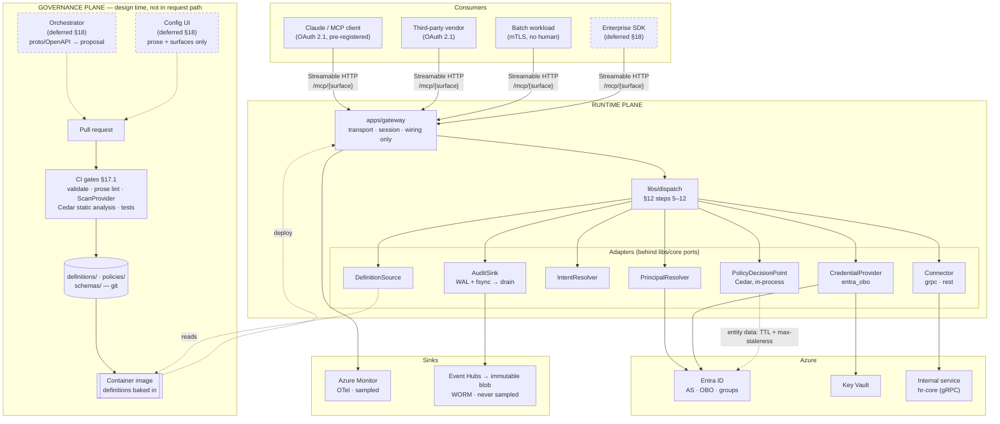
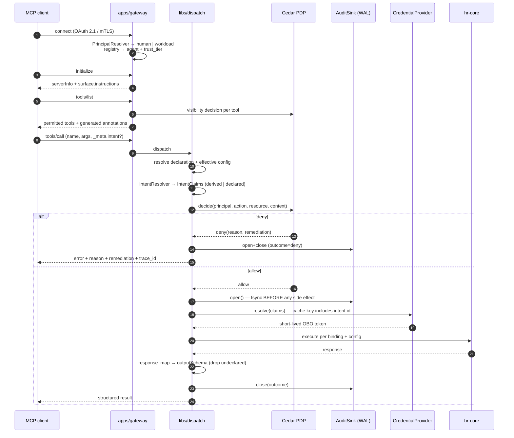
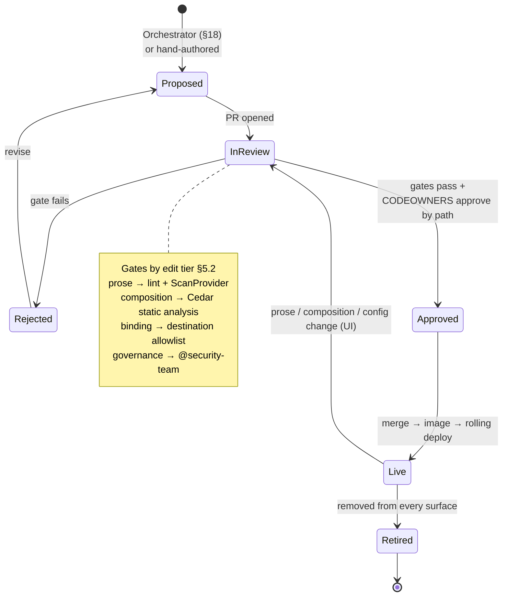
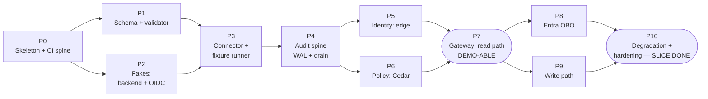

# MCP Gateway — Design

**Date:** 2026-09-04
**Status:** Approved for implementation planning
**Scope:** Slice one — a thin vertical slice through the Gateway

---

## 1. Purpose

Expose enterprise services to AI agents as MCP tools, such that every action is
governed by declaration and traceable end to end along the chain:

```
human → agent → intent → tool → resource → action → destination
```

The system has three subsystems. This document specifies **only the Gateway
slice**; the others get their own spec and plan cycles.

| Subsystem | Role | This spec |
|---|---|---|
| **Orchestrator** | Design-time. Generates *proposed* MCP definitions from service artifacts (proto, OpenAPI) using an LLM. Never in the request path. | Contract only (§18) |
| **Definition** | The declarative contract. YAML in git, governed by PR. | **Yes** |
| **Gateway** | Runtime. Loads definitions, serves MCP, executes calls, resolves identity, records the chain. | **Yes** |

---

## 2. Principles

These are load-bearing. Where a later decision seems arbitrary, it traces back
to one of these.

1. **Declare, don't infer.** Every element of the traceability chain is a
   declared field in a definition, not something reconstructed at runtime from
   logs. This is what makes the audit record trustworthy.
2. **Prefer destinations that enforce their own authorization.** Where a
   destination cannot, the Gateway becomes the sole authority over data whose
   sensitivity it does not own — a confused deputy. That requires field-level
   authorization, which is a subsystem, not a feature.
3. **Human-in-the-loop is a declared authorization step, never a fallback for
   missing information.** Uncertainty resolves to deny, not to an interrupt.
4. **Never claim a stronger guarantee than the mechanism delivers.** An audit
   trail that overstates itself is worse than one that admits its limits.
5. **Fail closed, fail loudly, and be trivially debuggable.** A fail-closed
   system dies from unexplained denials more often than from outages.
6. **Enforce architecture in CI.** Boundaries that are not mechanically
   enforced decay within a few sprints.
7. **KISS / DRY / declarative.** One schema generates validation, types, docs,
   review routing, and (later) the UI. Adding a tool means adding data, not code.

---

## 3. Decision record

| # | Decision | Choice | Rationale |
|---|---|---|---|
| D1 | Build order | Thin vertical slice through the Gateway | Proves the hardest risk (delegated identity + traceability) first; makes the schema empirical |
| D2 | Slice destinations | Internal Azure/Entra only | Destination-enforced authorization (P2) |
| D3 | Intent | Unsigned intent claims recorded in the audit event; signing STS deferred (§18) | Nothing in slice one verifies a signed token, so the signing infrastructure would serve zero verifiers |
| D4 | Wire protocol | MCP OAuth 2.1 session + optional `_meta` intent | Non-forgeable human identity; degrades for vanilla clients |
| D5 | Definition format | YAML in git; JSON Schema as meta-schema | PR-gated governance with zero new infrastructure |
| D6 | Policy engine | Cedar, behind a `PolicyDecisionPoint` port | In-process (no PDP network hop); statically analyzable |
| D7 | Language | Python (FastAPI + FastMCP); Go dataplane extraction behind a written trigger (§17.3) | One toolchain now; known ceiling made explicit |
| D8 | Traceability | OTel spans **and** a separate audit log in immutable (WORM) storage | Sampling is correct for debugging and fatal for audit |
| D9 | Binding | Typed protocol connectors, declaratively configured | Avoids inventing an expression language |
| D10 | Distribution | Definitions baked into the image; `DefinitionSource` port | Image digest ↔ git SHA gives unambiguous "what was live when" |
| D11 | Testing | Per-tool declarative fixtures + global invariants | Adding a tool adds data, not tests |
| D12 | Client registration | Pre-registered OAuth clients **and** mTLS workload identities | Entra does not support OAuth DCR |
| D13 | UI-tier review gate | Static gates now; behavioral eval as a triggered phase | Cannot build a meaningful eval corpus before there are tools |
| D14 | Escalation | **Deferred** (§18). Slice one is `allow \| deny(remediation)`; write access requires standing Entra group authorization | A rare path built before it is needed is rarely built right |
| D15 | Degradation | Fail closed with local durable WAL + async queue drain | Sink outage must not be a traffic outage |
| D16 | Tamper evidence | Azure immutable blob with legal hold; hash chains **deferred** (§18) | WORM already provides the guarantee; an attacker with pod access controls the chain computation too, so chains add machinery without adding defence |
| D17 | Preconditions (`prior_read`) | **Deferred** (§18) | Requires a queryable audit index in the request path — a subsystem, not a field |

---

## 4. Domain architecture

**Ports and adapters**, chosen for three specific reasons: domains become
independently testable, the Go extraction (D7) has a ready seam, and the
definition schema stays free of I/O concerns.

### 4.1 Component view

Note the two planes. The **governance plane** is design-time and never in the
request path; the **runtime plane** never writes to git. The only coupling
between them is a container image (D10).



### 4.2 Request sequence



The `alt` branch is the point of the diagram: **a deny is audited exactly as
thoroughly as an allow**, and neither path can reach `B` without a prior fsynced
`open` (invariant I1).

### 4.3 Definition lifecycle



### 4.4 Repository layout

```
libs/core/                  # PURE. Zero dependencies. The DRY spine.
  types.py                  #   Principal, AgentIdentity, IntentClaims, ToolCall,
                            #   Resource, Action, Destination, Decision, AuditEvent
  ports.py                  #   DefinitionSource, PolicyDecisionPoint, PrincipalResolver,
                            #   IntentResolver, CredentialProvider, Connector,
                            #   AuditSink, ScanProvider

libs/definition/            # schema load, parse, validate, cross-layer rules. No I/O.
libs/policy/                # Cedar adapter + static analyzer
libs/identity/              # PrincipalResolver; IntentResolver;
                            #   CredentialProvider adapters: entra_obo
libs/connectors/            # Connector adapters: grpc, rest. Each ships a schema fragment.
libs/audit/                 # AuditEvent, WAL + fsync, drain worker; OTel wiring
libs/dispatch/              # THE ORCHESTRATION OF §12. Steps 5–14 live here, not in the app.

apps/gateway/               # MCP server: transport, session, wiring. Near-zero logic.

definitions/                # DATA, not code.
  destinations/             #   egress allowlist            @security-team
  tools/<service>/<tool>/   #   prompt | interface | binding | governance | fixtures
  surfaces/<name>.yaml      #   published MCP servers
  clients/registry.yaml     #   client_id → agent, auth method, trust tier
policies/                   # Cedar policy set               @security-team
schemas/                    # JSON Schema — source of truth for all generated artifacts
tools/fakes/                # reference backend + fake OIDC provider (normative for tests)
tests/
  invariants/               # §16.5
  guardrails/               # intentionally-invalid definitions + expected error codes
```

### 4.5 Dependency rule

Every library depends on `libs/core` **and only on `libs/core`**. No library
imports another library. Only `apps/gateway` composes implementations onto
ports, once, at startup.

**Enforced in CI** via `import-linter` (P6). A violation fails the build.

### 4.6 Consequence to watch

`apps/gateway` must contain protocol handling and wiring only. If business
rules accumulate there, the boundaries have leaked — that is a review finding,
not a style preference.

---

## 5. The definition model

### 5.1 Four files, three domains

The contract domain splits across two files because blast radius differs.

| File | Contains | Blast radius | UI-editable | Owner |
|---|---|---|---|---|
| `prompt.yaml` | tool description, per-param descriptions, usage hints | changes **model behavior** | **yes** | `@platform-dx` |
| `interface.yaml` | tool name, `inputSchema`, `outputSchema`, `configSchema`, `interface_version` | **breaks consumers** | no | `@platform-eng` |
| `binding.yaml` | destination ref, connector, operation, field map | changes **where data goes** | no | `@platform-eng` |
| `governance.yaml` | resource, action, classification, policy refs, approval, preconditions | changes **what is permitted** | no | `@security-team` |

The UI writes to exactly two file kinds: `prompt.yaml` and `surfaces/*.yaml`.
It can never touch a destination or a permission. This is enforced by
**filesystem path**, not by application logic.

### 5.2 Edit tiers in the meta-schema

Editability is a per-field annotation in the JSON Schema:

```yaml
description:
  type: string
  x-edit-tier: prose        # prose | composition | config | platform | security
```

One annotation, four consumers, no duplication:

- the future UI renders editable fields by tier;
- CI derives which review gate a diff must clear;
- the security scanner knows a `prose` diff is prompt-injection surface while a
  `platform` diff is exfiltration surface;
- documentation generation marks operator-tunable fields.

### 5.3 Review routing via CODEOWNERS

Path-based, so it needs no custom tooling and cannot be bypassed by a bot:

```
definitions/**/governance.yaml   @security-team
definitions/**/binding.yaml      @platform-eng
definitions/**/interface.yaml    @platform-eng
definitions/**/prompt.yaml       @platform-dx
definitions/destinations/**      @security-team
definitions/clients/**           @security-team
policies/**                      @security-team
schemas/**                       @platform-eng @security-team
```

### 5.4 Example — read tool

```yaml
# definitions/tools/hr/get_worker_profile/prompt.yaml
description: |
  Retrieve a worker's profile: legal name, worker id, department, and manager.
  Use when the user asks about a specific person's role or reporting line.
param_descriptions:
  worker_id: The worker's stable identifier, e.g. "W-10423".
```

```yaml
# interface.yaml
name: hr_get_worker_profile
interface_version: 1
inputSchema:                       # MODEL-facing: the agent fills these per call
  type: object
  additionalProperties: false
  required: [worker_id]
  properties:
    worker_id: {type: string, pattern: "^W-[0-9]{5}$"}
outputSchema:                      # curated approved model — never a passthrough
  type: object
  additionalProperties: false      # REQUIRED by validation (§5.7)
  properties:
    worker_id:  {type: string}
    legal_name: {type: string}
    department: {type: string}
    manager_id: {type: string}
configSchema:                      # OPERATOR-facing: a human sets these once
  type: object
  additionalProperties: false
  properties:
    include_manager_chain: {type: boolean, default: false}
```

```yaml
# binding.yaml
destination: hr-core               # MUST exist in definitions/destinations/ (§5.6)
connector: grpc
operation:
  service: hr.v1.WorkerService
  method: GetWorker
field_map:
  worker_id: request.worker_id
response_map:
  worker_id:  response.worker.id
  legal_name: response.worker.legal_name
  department: response.worker.org.name
  manager_id: response.worker.manager.id
```

```yaml
# governance.yaml
resource:
  type: worker
  id_from: input.worker_id         # omit for type-scoped operations (e.g. list)
action: read
data_classification: pii
intent_requirement: derived_ok     # illegal when action != read (§5.7)
payload_logging: hashed
policies: [hr.worker_read]
```

### 5.5 Example — write tool

```yaml
# definitions/tools/hr/update_worker_department/governance.yaml
resource: {type: worker, id_from: input.worker_id}
action: write
data_classification: pii
intent_requirement: declared_required
requires_human_principal: true     # never under a workload identity
payload_logging: hashed
policies: [hr.worker_write]        # MUST require a group (§5.8)
```

Write authorization in slice one is **standing**, not per-action: the human must
already hold the Entra group the policy requires. Per-action sign-off is the
deferred escalation subsystem (§18), and until it exists a write the human is
not standingly authorized for is a `deny` with declared remediation — per §11.2,
which is the correct answer for that case anyway.

### 5.6 Egress allowlist

A `binding.yaml` may reference only a destination registered here. Without this,
a binding diff is an exfiltration path.

```yaml
# definitions/destinations/hr-core.yaml          @security-team
name: hr-core
kind: internal
endpoint: hr-core.internal.example.com:443
protocols: [grpc]
auth_profile:
  provider: entra_obo
  scope: api://hr-core/.default
  attestation_enforcement: gateway_only           # §8.4
```

Validation rejects any binding naming an unregistered destination.

### 5.7 Generated, never authored

A hand-written duplicate is a lie waiting to happen. These are derived:

| Derived | From | Why |
|---|---|---|
| MCP tool `annotations` (`readOnlyHint`, `destructiveHint`, `idempotentHint`) | `governance.action` | The contract cannot contradict the governance layer |
| `definition_version` | content hash of the four files | Manual version fields rot |
| Audit `resource` / `action` / `destination` | the declared fields | Chain becomes a property of the declaration |
| Language types, docs, UI form | `schemas/` | Single source of truth |

### 5.8 Validation layers

1. **Structural** — JSON Schema.
2. **Cross-layer** — real code in `libs/definition`, the strictest tests in the
   repo:
   - every `field_map` key exists in `inputSchema`;
   - every `response_map` key exists in `outputSchema`;
   - `outputSchema.additionalProperties` is `false` (approved-model rule);
   - `intent_requirement: derived_ok` is illegal when `action != read`;
   - when `action` is `write` or `delete` **and** `data_classification` is
     `pii`, the tool must declare at least one `policies` entry, and static
     analysis (§10.4) must prove every such policy requires group membership —
     this replaces the deferred `approval` requirement;
   - `preconditions` and `approval` are **reserved**: present in the schema so
     enabling them later is not a breaking change, but any use is a validation
     error until the deferred subsystems ship (§18);
   - `binding.destination` is registered;
   - every tool has `fixtures.yaml`.
3. **Static policy analysis** — §10.4.

### 5.9 Naming and versioning

- MCP tool name: `{service}_{operation}`, snake_case, globally unique.
- Definition ref in surfaces: `{service}.{operation}` (dotted).
- `definition_version`: content hash, computed at build. Never hand-edited.
- `interface_version`: a manual integer in `interface.yaml`. CI compares the
  compiled `inputSchema`/`outputSchema` against the merge base and **fails if an
  incompatible change did not bump it**. This is the only manual version burden.

### 5.10 Controlled vocabularies

Every enumerated field is closed. An unrecognised value is a validation error,
never a pass-through — otherwise a typo silently becomes a permission.

| Field | Values | Notes |
|---|---|---|
| `action` | `read` \| `write` \| `delete` | Drives generated MCP annotations (§5.7) and retry policy (§14) |
| `data_classification` | `public` \| `internal` \| `confidential` \| `pii` | Ordered by sensitivity; `pii` triggers the §5.8 group-policy rule for writes |
| `payload_logging` | `none` \| `hashed` \| `full` | Security-owned; `hashed` is the default |
| `intent_requirement` | `derived_ok` \| `declared_required` \| `granted_required` | `granted_required` is reserved, unusable until the `granted` tier ships (§18) |
| `intent.attestation` | `derived` \| `declared` \| `granted` | §9.1 |
| `attestation_enforcement` | `gateway_only` \| `destination_verified` | §8.4; `destination_verified` is **reserved** until the signing STS ships (§18) |
| `principal_type` | `human` \| `workload` | §8.1 |
| `auth_method` | `entra_oauth` \| `mtls` | §7 |
| `trust_tier` | `trusted` \| `internal` \| `restricted` | `trusted`: human-present, first-party. `internal`: workload inside the enterprise boundary. `restricted`: third-party or unattested; composition analysis (§6) forbids `write` + `pii` tools on any surface whose audience includes a `restricted` client. |
| `x-edit-tier` | `prose` \| `composition` \| `config` \| `platform` \| `security` | `composition` and `config` apply to surface fields; the others to tool fields |
| `approval.level` | `1` \| `2` \| `3` | **Reserved** until escalation ships (§18). `1`: any peer with the resource's read permission. `2`: the resource's owning manager. `3`: a named control function (e.g. HR compliance). Higher levels do not subsume lower — `authority` names *who*, `level` records *how far up*, and both are recorded in the audit event. |

### 5.11 MCP spec revision

Pin the target revision as a constant in the repo and record it in the audit
event. Baseline: `2025-06-18`. **Verify the current revision at implementation
time** — `outputSchema`, structured content, and `elicitation` arrived in
specific revisions and third-party consumer support varies. Maintain
`docs/mcp-compatibility.md` as a consumer × capability matrix; a compatibility
gap must be a written row, not a discovered incident.

---

## 6. Surfaces and configuration

A **tool** is catalogue. A **surface** is a published MCP server. Configuration
lives on the surface, so one tool definition serves many surfaces with different
tuning — that is why they are separate files.

```yaml
# definitions/surfaces/hr-assistant.yaml       ← the "MCP"; the UI's main write target
name: hr-assistant
instructions: |                                # prose tier, model-visible
  You are operating against internal HR data. Always confirm the worker's
  identity by reading their profile before proposing any change.
audience: [claude-desktop, internal-sdk]       # client `name` values from clients/registry.yaml
tools:                                         # composition tier
  - ref: hr.get_worker_profile
    config:                                    # config tier, validated against configSchema
      include_manager_chain: true
  - ref: hr.update_worker_department
```

Three consequences built in deliberately:

1. **Composition is a privilege change, so it is policy-gated statically.**
   Adding a tool to a surface expands what agents can do. Cedar evaluates
   surface composition in CI — e.g. a surface whose `audience` includes an
   `restricted`-tier client may not include a tool with `action: write` and
   `data_classification: pii`. A governance rule becomes a build failure.
2. **Effective config is recorded in the audit event.** "This call ran with
   `include_manager_chain: true`" is part of what happened.
3. **Config narrows, never widens.** `configSchema` bounds (`maximum`, enums,
   allowed subsets) are the guardrail. Anything that would widen scope is a
   `governance.yaml` change, which routes to `@security-team`.

**Deliberate YAGNI:** descriptions live on the tool, not per-surface.
Per-surface prose overrides multiply the prompt-review surface by the number of
surfaces; add when asked for, not before.

Transport and routing: **Streamable HTTP only**, one route per surface at
`/mcp/{surface}`. No stdio, no legacy SSE — all consumers are remote.

---

## 7. Client registry

Entra ID does not support OAuth Dynamic Client Registration (RFC 7591), which
the MCP spec expects. Clients are therefore pre-registered and declared in git,
and workload identities may authenticate without OAuth.

```yaml
# definitions/clients/registry.yaml            @security-team
clients:
  - client_id: 1f9c...                # Entra app registration
    name: claude-desktop
    auth_method: entra_oauth
    principal_type: human             # a human is authenticated per session
    trust_tier: trusted
    surfaces: [hr-assistant]

  - client_id: batch-recon-svc
    name: reconciliation-job
    auth_method: mtls
    principal_type: workload          # NO human — chain starts at the agent
    trust_tier: internal
    surfaces: [hr-batch]
```

Onboarding a consumer is a reviewed PR. For a system touching HR data that is a
feature, not friction.

---

## 8. Identity

Three problems, kept separate because they are constantly conflated.

| # | Question | Answer |
|---|---|---|
| 1 | Who is the human? | Entra-issued OAuth token at the MCP edge |
| 2 | Which agent is acting? | Registered `client_id` (OAuth) or mTLS cert subject |
| 3 | How do we act *as* the human at the backend? | Entra On-Behalf-Of |

### 8.1 Two principal types, represented honestly

```
Principal = human(sub, tenant, via entra_oauth)      # human-present
          | workload(client_id, via mtls)            # no human — chain starts at agent
```

The chain must state the absence of a human rather than fabricate a subject.
`requires_human_principal: true` in `governance.yaml` makes this a declarative
control; Cedar denies such tools to workload principals, checkable statically
per surface.

### 8.2 At the edge

The Gateway is an OAuth 2.1 **resource server**, not an authorization server:

- publishes protected-resource metadata (RFC 9728) pointing at Entra;
- Entra issues tokens audience-restricted to the Gateway (RFC 8707 `resource`);
- the Gateway holds no user credentials and human identity is non-forgeable.

### 8.3 Intranet delegation

Entra **On-Behalf-Of**: exchange the user's token for a downstream token via
`grant_type=urn:ietf:params:oauth:grant-type:jwt-bearer`. The Gateway
authenticates as a confidential client using **workload identity federation** —
no stored secret, and every credential in the chain is short-lived.

The downstream service receives the **human's** identity and enforces its own
rules. "Can user A read compensation?" is answered by the system that owns the
data, which is the only place it can be answered correctly (P2).

### 8.4 Intent-binding fidelity is declared, not claimed

Entra will not let arbitrary intent claims be injected into its tokens, so
binding strength differs by destination. The destination **declares** which
applies, and the audit record carries it (P4):

| `attestation_enforcement` | Meaning |
|---|---|
| `gateway_only` | The destination does not verify our intent claims. Binding is Gateway-enforced: the credential is resolved only after a policy `allow`, and the credential cache key includes the intent id, so it cannot cross intents. Real, but it is one component's discipline rather than a verified property. |
| `destination_verified` | **Reserved.** The destination verifies the Gateway's signed intent token alongside the OBO token — genuine intent-bound identity enforced at the destination. Unusable until the signing STS ships (§18) *and* a downstream service agrees to validate it. |

**Every destination in slice one is `gateway_only`,** including internal ones,
because no downstream service verifies intent claims yet. Recording the weaker
value is the point of P4: the audit trail must not imply an enforcement the
mechanism does not deliver.

### 8.5 Secrets

No secrets in configuration. Workload identity federation for Entra; Key Vault
for the intent-token signing key, with proactive rotation.

---

## 9. Intent

### 9.1 Three fidelity tiers

Naming here is deliberately conservative, per P4. An agent that self-reports an
intent is *authenticated* as to which agent, but its statement is not attested
by a human.

| Tier | Source | Meaning |
|---|---|---|
| `derived` | Gateway infers from `(tool, args, resource)` | No stated purpose. The honest default for vanilla clients. |
| `declared` | Agent supplies via `_meta` (SDK clients) | Agent-asserted purpose, non-repudiable only as to *which agent* said it. |
| `granted` | **Deferred** — human pre-approves an intent grant with a TTL and an allowed tool set | The only tier where a human attested the purpose. |

`granted` is specified as deferred (§18) so that `intent_requirement` does not
need a breaking change later.

### 9.2 Intent scope spans calls

An intent id **must** span multiple calls, otherwise `prior_read` preconditions
can never be satisfied.

- **`declared`** — the SDK supplies a task-scoped `intent.id`, stable across the
  calls that serve one task.
- **`derived`** — the Gateway assigns one intent id per **MCP session**. The
  session is the coarsest honest grouping available without agent cooperation.

### 9.3 Wire format

```json
{
  "_meta": {
    "gateway.intent": {
      "id": "task-8f3a2c",
      "statement": "Reconcile department assignments for the EMEA org",
      "parent_intent_id": null
    }
  }
}
```

Absent `_meta`, the Gateway derives the intent and records
`attestation: derived`. Nothing is forgeable, because the *agent* identity — the
part that matters for accountability — comes from the authenticated session,
not from `_meta`.

### 9.4 Intent claims

Per call, the `IntentResolver` assembles the full chain as an in-process
`IntentClaims` value:

```
principal      sub, principal_type (human | workload)
agent          client_id, trust_tier
intent         {id, attestation}
tool           {name, definition_version}
resource       {type, id}
action         read | write | delete
destination    service name
trace_id       correlates to audit + OTel
```

`IntentClaims` has two consumers in slice one:

1. **The PDP** — it is the `context` of the Cedar decision (§10.2).
2. **The audit event** — recorded verbatim, which is what makes the chain
   complete by construction (P1).

Plus one enforcement role: **the credential cache key includes `intent.id`**, so
a credential resolved under one intent can never be reused under another
(invariant I5). That is the whole of intent-binding in slice one, and it is
real — it just isn't cryptographic.

**Deliberately not built:** signing these claims into a JWT with a Key Vault
key, rotation, and a JWKS endpoint. Nothing in slice one would verify that
signature, because `destination_verified` requires changing the downstream
services to validate it — which is out of scope. Signing infrastructure with
zero verifiers is cost without a guarantee. See §18 for the trigger, and P4:
the audit record says `gateway_only`, which is the truth.

---

## 10. Policy

### 10.1 Engine

Cedar, embedded in-process behind the `PolicyDecisionPoint` port. Chosen for
three reasons: its principal/action/resource/context model maps almost 1:1 onto
the chain; it is deliberately not Turing-complete, so properties can be proven
over the whole policy set; and it needs no network hop, which removes the PDP
from the runtime failure surface (§15).

### 10.2 Mapping

```
principal  ← Principal (human or workload), with Entra groups as Cedar groups
action     ← governance.action                (read | write | delete)
resource   ← governance.resource.type + id_from
context    ← {agent: {client_id, trust_tier}, intent: {id, attestation},
              destination: {service, attestation_enforcement},
              data_classification, surface, config, principal_type,
              requires_human_principal}
```

### 10.3 Illustrative policies

```cedar
permit (
  principal in Group::"HR-Core-Readers",
  action == Action::"read",
  resource is Worker
) when {
  context.agent.trust_tier == "trusted"
};

// P3: uncertainty resolves to deny, so this forbid is belt-and-braces, not the mechanism
forbid (principal, action, resource)
when {
  context.principal_type == "workload" && context.requires_human_principal
};

// mirrors the asserted property in §10.4
forbid (principal, action, resource)
when {
  context.data_classification == "pii" &&
  (action == Action::"write" || action == Action::"delete") &&
  context.intent.attestation == "derived"
};
```

### 10.4 Static analysis in CI

A governance artifact, not merely a test. CI runs Cedar validation against the
schema, then asserts named properties over the whole policy set, e.g.:

- nothing permits `write` to `pii` under `attestation: derived`;
- nothing permits any action to a `workload` principal on a tool declaring
  `requires_human_principal`;
- every surface's composition satisfies its `audience` trust-tier constraints.

Output is a report committed as a CI artifact — the thing you hand an auditor.

### 10.5 Entity data

Group memberships come from Entra at runtime. Cached with a TTL **and a hard
max-staleness**; past max-staleness the Gateway fails closed (§15). This — not
the engine — is the real runtime policy risk.

---

## 11. Decisions, preconditions, escalation

### 11.1 Outcomes

```
Decision = allow
         | deny(reason, remediation)
         | escalate(authority, level)   # RESERVED — see §18
```

Slice one implements `allow` and `deny` only. `escalate` is reserved in the type
so adding it later is not a breaking change to the audit format or the PDP port.

No obligations in slice one either. Field-level redaction belongs with
field-level authorization (§18), and a half-built obligation mechanism is worse
than none.

### 11.2 What is *not* a human-in-the-loop event (P3)

| Situation | Wrong | Right |
|---|---|---|
| Agent missing an argument | prompt a human | **Structured error** naming what is missing — the agent resolves it |
| Human genuinely lacks the permission | approval prompt | **Deny** + declared remediation ("request role `comp_admin`") |
| Action requires a *second* authority by design | — | **Declared escalation** — the only real HITL (deferred, §18) |

**Uncertainty resolves to deny, never to a human.** An undecidable case is a gap
in the policy set: a bug to fix in git, and the denial is auditable evidence of
the gap.

### 11.3 Structured errors and remediation

The one part of P3 that slice one *does* implement: a refusal always tells the
agent or the human precisely what to do, so nothing degrades into an interrupt.

```json
{
  "error": "policy_denied",
  "reason": "principal not in group HR-Core-Writers",
  "remediation": {"request_role": "HR-Core-Writers", "via": "https://access.example.com/..."},
  "trace_id": "..."
}
```

Validation failures use the same envelope with an argument-level `remediation`
the agent can act on immediately.

### 11.4 Deferred: preconditions and escalation

Both are specified in §18 with triggers, and their fields are reserved in the
schema (§5.8). Recording the reasoning, since it is easy to lose:

**`prior_read` preconditions** would let the Gateway verify *"did this intent
already read the worker it is about to modify?"* — turning the audit spine into
an authorization input that blocks blind writes. Attractive, and deferred
because it needs a **queryable index over audit records in the request path**.
Neither the WAL nor an Event Hubs stream can answer that query; that index is a
subsystem with its own availability and consistency story, not a governance
field.

**Escalation** requires an approval store, an out-of-band notification path,
args-hash pinning, TTL handling, and re-call resumption. Note also that MCP's
`elicitation` capability is **the wrong mechanism** for it — the connected human
is not the higher authority, so escalating to a manager cannot route through the
agent's own session. Until it exists, a human who lacks authorization gets
`deny` with declared remediation (§11.2), which is the correct answer for the
common case regardless.

---

## 12. Request lifecycle

Every step names the port it passes through, which is how the boundaries get
verified.

```
consumer                 GATEWAY (apps/gateway = wiring only)                backend
   │
   │ 1. connect ──────►  OAuth 2.1 / mTLS: validate credential
   │                     PrincipalResolver  → Principal (human | workload)
   │                     clients/registry.yaml → AgentIdentity + trust_tier
   │
   │ 2. initialize ───►  DefinitionSource → surface (route /mcp/{surface})
   │  ◄───────────────── serverInfo + surface.instructions
   │
   │ 3. tools/list ───►  surface tools ─filter─► PDP (visibility)
   │  ◄───────────────── tools + GENERATED annotations
   │
   │ 4. tools/call ───►  name, args, _meta.intent?
   │                       │
   │                     5. resolve declaration + effective config
   │                     6. IntentResolver → IntentClaims (derived | declared)
   │                     7. PDP (Cedar) → allow | deny
   │                     8. AuditSink.open()   ◄── durable, BEFORE any side effect
   │                     9. CredentialProvider.resolve(claims) → entra_obo
   │                          cache key includes intent.id  → invariant I5
   │                    10. Connector.execute()  ────────────────────────► call
   │                    11. response_map → outputSchema (drop undeclared)  ◄─── resp
   │                    12. AuditSink.close(outcome)
   │  ◄───────────────── result
```

Four properties that are deliberate choices, not implementation details:

**Step 3 filters, it does not merely deny.** An unauthorized tool is *absent*
from `tools/list`. Beyond defence in depth: every tool shown costs context and
invites the model to try it. Filtering keeps the prompt surface minimal, which
is a quality argument as much as a security one.

**Step 8 always precedes step 10.** The audit record opens durably before any
side effect can occur. This ordering is what makes invariant I1 mechanically
testable rather than aspirational. Denials are audited too — a blocked call is
often the more interesting record.

**Step 9 is the intent-binding seam.** The credential is resolved only after a
policy `allow`, under a cache key that includes `intent.id`. That is what
`gateway_only` enforcement means concretely (§8.4): binding by the Gateway's own
discipline, honestly recorded as such.

**Steps 5–12 live in `libs/dispatch`, not in the app.** If they cannot be moved
there, §4.5 has been violated.

---

## 13. Traceability

Two sinks, because sampling is correct for one purpose and fatal for the other.

| | OTel traces | Audit log |
|---|---|---|
| Purpose | latency, debugging | governance, "who did what to whose data, on whose behalf, why" |
| Sampling | yes | **never** |
| Retention | short | long, immutable |
| Store | Azure Monitor | Event Hubs → blob with legal hold |
| Correlation | `trace_id` | `trace_id` |

Conflating them means the one call you get asked about is the one that was
sampled away.

### 13.1 Audit event

Every field comes from a declaration, which is what makes the chain complete by
construction (P1).

```yaml
record:      {id, seq, writer_id}      # writer_id = gateway instance-epoch
trace_id:    ...
phase:       open | close
principal:   {type: human|workload, sub, tenant, auth_method}      # ← human
agent:       {client_id, name, trust_tier}                         # ← agent
intent:      {id, attestation: derived|declared, statement?}       # ← intent
surface:     {name, version}
tool:        {name, definition_version, interface_version, git_sha}# ← tool
config:      {include_manager_chain: true}                         # effective config
resource:    {type: worker, id: "W-10423"}                         # ← resource
action:      read | write | delete                                 # ← action
destination: {service, auth_profile, endpoint,
              attestation_enforcement}                             # ← destination
decision:    {outcome, determining_policies, reason}
payloads:    {args_hash, result_hash}       # per governance.payload_logging
mcp:         {spec_revision}
outcome:     {status, backend_status, latency_ms, error_class}      # close only
clock:       {opened_at, closed_at}
```

### 13.2 Three points that matter more than they look

**`git_sha` + `definition_version` in every record.** Combined with definitions
baked into the image (D10), *"what exactly was this tool configured to do at
14:32 last Tuesday"* has one unambiguous answer. This is traceability of the
**declaration**, not just of the call.

**Tamper-resistance comes from the store, not from the record.** Audit events
land in Azure immutable blob storage with legal hold — WORM, enforced by the
platform and outside the Gateway's own trust boundary, which is exactly where
such a guarantee has to live. `writer_id` plus a monotonic `seq` per
instance-epoch gives gap detection: a missing sequence number is visible without
any cryptographic construction.

Application-level hash chaining is deliberately **not** built (§18). An attacker
who can rewrite audit records on a pod also controls the chain computation on
that pod, so a self-computed chain defends against a threat it cannot actually
stop, while adding chain epochs, head anchoring, and crash reconciliation of
buffered records. The cost is real and the guarantee is not.

**Payload logging is governed, not configured.** `payload_logging:
none|hashed|full` lives in `governance.yaml` (security-owned), never on a
surface. `hashed` is the useful default: it proves *what* was sent without
retaining PII, so two calls can be compared for equality — and later matched
against an approval ticket (§18) — without the data ever being stored.

---

## 14. Error handling

Errors are classed by who can act on them, because that determines the shape of
the response.

| Class | Response | Who fixes it |
|---|---|---|
| Validation | structured error + `remediation` | the **agent**, immediately |
| Policy deny | `deny` + reason + remediation | the **human**, out of band |
| Credential failure (OBO expired) | retriable; one silent refresh, then surface | the **gateway** |
| Backend 5xx / timeout | mapped error; no retry on non-idempotent | **nobody** — report honestly |
| Governance-infra failure | §15 | operator |

Retry policy is read from a declaration, never guessed: `action: read` is
retriable; `write`/`delete` retry only when `idempotencyHint` is declared. Never
infer idempotency.

**Never return a partial success as a success.** If the backend wrote but the
audit `close` failed, that is a distinct, alarmed state. The agent must not be
told "done."

Every error returned to an agent carries `trace_id`.

---

## 15. Degradation

### 15.0 The audit WAL

**WAL — write-ahead log.** A local append-only file on the pod's disk. At §12
step 8 the Gateway appends the audit `open` record and **fsyncs** it before step
10 issues the backend call; only a durable local write lets the call proceed. An
async drain worker ships records to Event Hubs → immutable blob storage and
truncates them on acknowledgement.

"Write-ahead" names the ordering guarantee: the record of an action is durable
*before* the action occurs, so an unrecorded action is structurally impossible
rather than merely unlikely. This is what makes invariant I1 hold.

Its purpose is to decouple *"the audit record is durable"* from *"the audit
record reached the remote store."* Without it the only options are to block every
call on a remote write — coupling Gateway availability to Event Hubs — or to
proceed unlogged, which creates the untraceable window this system exists to
prevent.

Its cost is that a sink outage moves audit durability onto a single pod's disk
(§15.2, `wal_oldest_unshipped_age_s`).

### 15.1 Failure modes

The governance components fail differently, so one policy does not fit.

| Component | How it fails | Design |
|---|---|---|
| **Audit sink** | Event Hubs unreachable | Local **append-only WAL** on the pod; async drain to the queue. A sink outage is not a traffic outage. |
| **Audit WAL** | disk unwritable | Pod goes **unready** and stops serving. No unlogged action. |
| **Cedar policy set** | invalid or unloadable | A **deploy-time** failure: policies compile and validate in CI, and again at boot. A pod that cannot load its policy set never becomes ready. |
| **Cedar entity data** | Entra group lookup stale | TTL **and** hard max-staleness. Past max-staleness → fail closed, loudly. The real runtime risk. |
| **Entra token endpoint** | OBO exchange unavailable | Not a governance failure: an upstream dependency error, surfaced honestly with `trace_id`. No fallback credential exists by design. |

Slice one has **two** stateful runtime components — the WAL and the Cedar entity
cache — and no database. That is a deliberate consequence of the §18 deferrals.

Embedding the PDP (D6) is what moves the largest failure mode from runtime to
deploy time.

### 15.2 Fail loudly, concretely

Readiness reflects **governance capability**, not process liveness. A
`GovernanceHealth` object with named components drives `/readyz` *and* appears in
the error body, so a failure names itself instead of surfacing as a generic 503:

```json
{
  "error": "governance_unavailable",
  "governance_health": {
    "wal_writable": true,
    "policy_loaded": true,
    "entity_cache_fresh": false,
    "entity_cache_age_s": 812,
    "entity_cache_max_staleness_s": 600,
    "wal_oldest_unshipped_age_s": 3
  },
  "trace_id": "..."
}
```

Drain lag past a threshold alarms, then applies backpressure. Silent buffering
without an alarm is the failure mode to design against.

### 15.3 Easy to fix — `just explain`

One debuggability feature earns its place in slice one. "Why was I denied?"
answered authoritatively from the audit record plus Cedar's determining policies:

```
$ just explain <trace_id>
principal:   human(alice@…) via entra_oauth      agent: claude-desktop (tier: trusted)
intent:      i-8f3a  attestation: derived        surface: hr-assistant
tool:        hr_get_worker_profile @ git 4c1b9e2  def_version: 9a2f1c
resource:    worker/W-10423                      destination: hr-core (gateway_only)
decision:    DENY
  determining policy: hr.worker_read:12
  reason: principal not in group HR-Core-Readers
  entity data age: 45s
remediation: request role comp_admin
```

Available as both a CLI and an operator endpoint. Cheap to build; pays back
constantly.

---

## 16. Testing

Five layers. The property that matters: **adding a tool means adding data, not
writing tests.**

### 16.1 Unit

Pure libraries only, no I/O: cross-layer validation rules, Cedar decision
tables, audit `seq` gap detection, connector field mapping, intent-claim
assembly, credential cache-key derivation.

### 16.2 Definition conformance

CI enumerates `definitions/tools/`. Every tool must validate structurally, pass
every cross-layer rule (§5.8), and **have `fixtures.yaml`**. A tool without
fixtures fails the build.

### 16.3 Fixture runner

One runner, N data files:

```yaml
# definitions/tools/hr/get_worker_profile/fixtures.yaml
cases:
  - name: happy path
    principal: {type: human, sub: alice, groups: [HR-Core-Readers]}
    config: {include_manager_chain: false}
    args: {worker_id: "W-10423"}
    expect_backend_request:
      service: hr.v1.WorkerService
      method: GetWorker
      body: {request: {worker_id: "W-10423"}}
    backend_response:
      response: {worker: {id: "W-10423", legal_name: "Bob Roe",
                          org: {name: "Finance"}, manager: {id: "W-10001"},
                          salary: 120000}}
    expect_output:
      worker_id: "W-10423"
      legal_name: "Bob Roe"
      department: "Finance"
      manager_id: "W-10001"
      # `salary` is absent: undeclared fields are dropped (§5.7)
    expect_decision: allow
    expect_audit:
      action: read
      resource: {type: worker, id: "W-10423"}
      payloads: {args_hash: "*", result_hash: "*"}

  - name: denied without group
    principal: {type: human, sub: carol, groups: []}
    args: {worker_id: "W-10423"}
    expect_decision: deny
    expect_no_backend_call: true
```

The `salary` case is the approved-model rule under test: a backend adding a
sensitive field never silently reaches a prompt.

### 16.4 Policy static analysis

§10.4, run in CI, output committed as an artifact.

### 16.5 E2E invariants

Real Gateway, fake OIDC provider, reference backend, real MCP client from the
SDK. These invariants **are** the governance guarantee, so they are a named
suite rather than incidental assertions:

```
I1  No backend request occurs without a preceding durable (fsynced) audit `open` carrying an `allow`
I2  Every completed call has a matched open/close pair, and `seq` per `writer_id` has no gaps
I3  No tool appears in tools/list that the PDP would deny for that principal
I4  MCP annotations always match governance.action (no contract/governance drift)
I5  A credential resolved under one intent.id is never reused under another
I6  requires_human_principal tools never execute under a workload principal
I7  Payloads are never persisted at higher fidelity than payload_logging declares
I8  A definition whose destination is unregistered is never loadable
I9  Every deny returned to a consumer carries a reason, a remediation, and a trace_id
```

I9 is a governance invariant, not a UX nicety: a system that fails closed
without saying why is one people route around (P5).

### 16.6 Guardrail tests

`tests/guardrails/` holds **intentionally invalid** definitions with expected
error codes. Test that the gate blocks, not merely that valid input passes. A
validator nobody has seen fail is a validator not known to work.

---

## 17. CI/CD and the governance pipeline

### 17.1 Pipeline

```
PR opened
  ├─ structural validation (JSON Schema)
  ├─ cross-layer validation (§5.8)
  ├─ interface_version bump check (§5.9)
  ├─ prose lint (length, injection markers, no contradiction of governance)
  ├─ ScanProvider port  ← future security scan API plugs in here; report → PR comment
  ├─ Cedar validate + static property assertions (§10.4) → report artifact
  ├─ surface composition analysis vs audience trust tiers
  ├─ unit + conformance + fixtures + guardrails + E2E invariants
  ├─ import-linter (architecture, §4.5)
  └─ CODEOWNERS review routing by path (§5.3)

merge → build image (definitions baked in) → rolling deploy
```

The `ScanProvider` port exists in slice one with a no-op-plus-lint
implementation, so the future security scan API is a configuration change rather
than a refactor. Its report attaches to the PR, per the intended governance flow.

### 17.2 Distribution

Definitions are baked into the image, so the running image digest maps to
exactly one git SHA — no runtime config fetching to secure or operate, and no
ambiguity about what was live when a call happened.

The loader sits behind the `DefinitionSource` port with
`notifications/tools/list_changed` wired up from day one, so moving to signed
bundles later is a configuration change, not a refactor.

### 17.3 Go extraction trigger (D7)

Python is the known ceiling for holding many concurrent long-lived MCP
connections. The extraction of `libs/dispatch` + `apps/gateway` to Go is
triggered when **any** of these holds for a sustained 7 days at production load:

- more than **1,500 concurrent MCP sessions per pod**, or
- **Gateway-attributable p99 overhead above 75 ms** (total p99 minus backend p99), or
- **CPU above 60%** at 50% of peak traffic.

Until a trigger fires, this is explicitly not work. The port boundaries (§4.5)
are what keep it a rewrite of two packages rather than of the system.

---

## 18. Deferred subsystems

Each gets its own spec and plan cycle. Triggers are written so deferral cannot
become indefinite by default.

| Subsystem | Trigger | Notes |
|---|---|---|
| **Escalation / approval tickets** | First tool that genuinely requires per-action second-authority sign-off | `Decision.escalate` and `governance.approval` are already reserved (§5.8, §11.1). Adds an approval store, out-of-band notification, args-hash pinning, TTL, and re-call resumption. Until then, standing Entra group authorization plus `deny` + remediation (§11.2). |
| **`prior_read` preconditions** | Together with the audit query index they require | Needs a queryable, indexed view of audit records in the request path — neither the WAL nor an Event Hubs stream can answer "did this intent read this resource". Field reserved in the schema. |
| **Intent-token signing STS (`destination_verified`)** | **When the first downstream service commits to verifying it** | Claims already assembled and audited (§9.4); this adds ES256 signing, a Key Vault key with rotation, a JWKS endpoint, and TTL/skew handling. Worthless until a verifier exists — build it *with* that service, not before. |
| **Hash-chained audit records** | An auditor requiring tamper-evidence beyond WORM, or audit records leaving Azure immutable storage | Immutable blob with legal hold already provides WORM outside the Gateway's trust boundary. Self-computed chains do not defend against an attacker who controls the pod. |
| **Field-level authorization + derived data models** | **Before any external-SaaS destination** | The prerequisite for D2. Adds output-field classification, obligations, redaction. `outputSchema.additionalProperties: false` is the hook it attaches to. |
| **External SaaS (Workday) destinations** | After field-level authz ships | Requires per-user OAuth consent, refresh-token lifecycle in Key Vault, and accepting `attestation_enforcement: gateway_only`. A service-account approach is rejected: it breaks the chain at the destination and makes the Gateway a confused deputy. |
| **Orchestrator** | After ≥5 hand-authored tools exist | Contract: consumes proto/OpenAPI, emits the four definition files **plus fixtures** as a **pull request**. Never writes to main. Its output is always a proposal; the §17.1 pipeline is the gate. |
| **Behavioral eval gate** | **Before non-engineers get UI write access** | Tool-selection eval over a maintained utterance corpus; blocks prose/composition/config diffs on regression. Cannot be built meaningfully before there are tools worth evaluating. |
| **Enterprise SDK** | After the first external consumer request | Supplies `declared` intents via `_meta`, handles escalation tickets and precondition remediation loops. Depends on `libs/core` types only. |
| **Configuration UI** | After the behavioral eval gate | Writes `prompt.yaml` and `surfaces/*.yaml` only, as PRs. Forms generated from `schemas/` via `x-edit-tier`. |
| **`granted` intent tier** | With the UI | Human pre-approves an intent grant (TTL + allowed tool set). The only tier where a human attests purpose. `intent_requirement` already reserves the value. |
| **DCR broker AS** | First consumer that cannot pre-register | Highest-blast-radius component in the design; do not build speculatively. |
| **Signed definition bundles** | When merge-to-live latency becomes a complaint, or long-lived vendor sessions cannot tolerate rolling deploys | `DefinitionSource` port already accommodates it. |

---

## 19. Slice one — scope and exit criteria

### 19.1 In scope

- `libs/core`, `definition`, `policy`, `identity`, `connectors`, `audit`, `dispatch`
- `apps/gateway`: Streamable HTTP, one surface, OAuth 2.1 resource server + mTLS
- Reference backend and fake OIDC provider in `tools/fakes/` — **normative for
  all tests**, which makes the slice fully buildable today
- Two tools against one internal Azure service: one `read`, one `write`. Both
  are required: without the write tool, OBO for a mutating call, write
  governance, and `requires_human_principal` all go untested.
- Cedar PDP + static analysis; `IntentResolver` (unsigned claims); audit WAL +
  queue drain → immutable blob; `just explain`
- Full §17.1 pipeline with a lint-only `ScanProvider`

No database, and two stateful runtime components (§15.1).

### 19.2 Out of scope

Everything in §18.

### 19.3 Exit criteria

The slice is done when all of these hold:

1. A real MCP client completes OAuth against Entra, lists exactly the tools
   policy permits it, and executes the read tool against a real internal Azure
   service via Entra OBO.
2. The write tool succeeds for a human holding the required Entra group, and
   returns `deny` with a `reason` and an actionable `remediation` for one who
   does not — and is refused outright under a workload principal.
3. `just explain <trace_id>` reproduces the full chain and the determining
   policy for one allow and one deny.
4. All nine invariants (§16.5) pass in E2E; all guardrail tests fail as expected.
5. The Cedar static-analysis report is generated as a CI artifact.
6. An Event Hubs outage injected in a test does not stop traffic; an unwritable
   WAL takes the pod unready.
7. `import-linter` passes with the §4.5 rule set, and `apps/gateway` contains no
   logic from §12 steps 5–12.
8. A definition referencing an unregistered destination, and one missing
   fixtures, both fail CI.

### 19.4 Plan-time inputs

The slice is fully specified and buildable against the in-repo reference
backend. One input is needed before the phase that hits real infrastructure
(exit criterion 1): **the name and proto of the first real internal Azure
service**, plus its Entra app registration and OBO scope. Owner: platform
engineering.

This blocks only exit criterion 1. Every other criterion — including the write
tool's authorization behaviour, all nine invariants, the guardrail tests, and the
degradation tests — is satisfiable against the reference backend, so
implementation can proceed in full while this input is pending.

---

## 20. Phased delivery

Eleven chained PRs rather than one merge. Two rules make the chain worth the
overhead:

1. **Every PR merges to `main` green and leaves the repo in a working state.**
   No long-lived feature branch, no "will be wired up in the next PR" — a PR
   that cannot be reviewed on its own merits is too big.
2. **Every PR states what it makes newly *verifiable*.** Not "added the audit
   library" but "an unfsynced audit record now fails the build."

### 20.1 The chain



`P1‖P2` and `P5‖P6` are genuinely parallel. **P7 is the first demo-able
milestone** — a real MCP client completing a governed call end to end. **P10
closes the slice.**

### 20.2 What each PR delivers

| PR | Scope | Newly verifiable | Exit criteria |
|---|---|---|---|
| **P0** | `uv` workspace, `just`, ruff, `mypy --strict`, pytest, `import-linter` with the §4.5 rule set, `libs/core` types + port ABCs (no impls) | A lib importing another lib **fails CI** — architecture enforced before there is code to violate it | — |
| **P1** | `schemas/` meta-schema with `x-edit-tier`, `libs/definition` (structural + all cross-layer rules), destinations & client registries, conformance runner, `tests/guardrails/` | `just validate` passes on one hand-authored read tool; an unregistered destination, a passthrough `outputSchema`, and a missing-fixtures tool all fail | 8 |
| **P2** | `tools/fakes/`: gRPC reference backend + OIDC provider issuing Entra-shaped tokens | The test substrate the rest of the chain asserts against | — |
| **P3** | `libs/connectors` (grpc), fixture runner executing definitions against the fake | A declarative binding executes with **no MCP, no auth, no policy**; undeclared response fields are dropped | — |
| **P4** | `libs/audit`: `AuditEvent`, WAL + fsync, drain worker, blob sink, OTel wiring | `seq` gap detection; payload fidelity honours `payload_logging` | I2, I7 |
| **P5** | `libs/identity`: `PrincipalResolver`, OAuth 2.1 resource server + RFC 9728 metadata, mTLS workload path, client registry loading | `human` vs `workload` principals resolved and distinguished against the fake OIDC | I6 |
| **P6** | `libs/policy`: Cedar adapter, initial policy set, CI static analyzer, decision tables | Named policy properties **proven** in CI; every deny carries reason + remediation | I9 |
| **P7** | `apps/gateway` + `libs/dispatch` steps 5–12 (read path), surface routing, `tools/list` filtering, generated annotations | **A real MCP client lists and calls the read tool end to end against fakes.** No backend call without a prior fsynced `open` | I1, I3, I4 |
| **P8** | `entra_obo` `CredentialProvider`, workload identity federation, intent-keyed credential cache | Read tool against the **real** internal service; a credential cannot cross intents | I5, **1** |
| **P9** | Write tool definition, `requires_human_principal`, group-required policy + its static assertion, deny + remediation envelope | Write succeeds with the group, denies actionably without it, refused under a workload principal | **2** |
| **P10** | `GovernanceHealth` + `/readyz`, WAL-unwritable → unready, entity-cache max-staleness, injected sink outage, `just explain` complete | A sink outage does not stop traffic; an unwritable WAL takes the pod out | **3, 6** |

### 20.3 Sequencing rationale

Three choices worth defending, since a reviewer will reasonably question them:

**Architecture enforcement lands in P0, before any code.** `import-linter` on an
almost-empty repo looks like ceremony, but P6 depends on it being impossible to
reach for a shortcut under deadline pressure. Retrofitted boundary rules fail on
day one against a hundred violations and get switched off.

**Audit (P4) precedes both identity and policy.** It is tempting to build
identity first because it feels foundational. But invariant I1 is an *ordering*
property between the audit write and the backend call — if audit arrives last it
gets bolted onto an existing call path rather than constraining its shape, which
is how "we log after the call" becomes permanent.

**The write path (P9) is deliberately after OBO (P8), not bundled with it.** P8
proves delegation against a real service on the read path, where a bug is
recoverable. Bundling the first mutating call with the first real credential
exchange means two novel mechanisms failing together, in a PR touching real HR
data.

### 20.4 Relationship to the implementation plan

This section is the delivery *shape*. The `writing-plans` step turns each PR into
tasks with TDD steps and review checkpoints; §20.2's "newly verifiable" column is
the acceptance criterion each phase's tests must satisfy.
